# OliveMe

> 사진 한 장으로 퍼스널 컬러를 진단하고, 팔레트·의상·메이크업·주변 매장·상품 추천까지 이어주는 Android Kotlin 앱입니다.

<p align="center">
  <a href="img/app-icon.png">
    
  </a>
</p>

## 프로젝트 소개

OliveMe는 얼굴 또는 상반신 사진을 기반으로 퍼스널 컬러 타입을 분석하고, 사용자가 바로 활용할 수 있는 컬러 가이드와 추천 흐름을 제공합니다. 앱은 Android Kotlin과 Jetpack Compose로 구현되어 있으며, 외부 API가 실패하거나 백엔드가 꺼져 있어도 seed 데이터와 로컬 fallback으로 종료 없이 동작하도록 설계했습니다.

핵심 목표는 단순한 화면 시연이 아니라 실제 앱처럼 안전하게 흐르는 경험입니다. 로그인, 통합 동의, 손글씨 2차 인증, 사진 진단, Gemini 분석/fallback, 결과 저장, OSM 지도, Google Maps 외부 연결, 마이페이지, 설정, 선택형 커머스 추천까지 하나의 사용자 여정으로 연결됩니다.

## 스크린샷과 채점 증빙

아래 이미지는 시연 순서와 채점 기준을 같이 볼 수 있도록 묶었습니다. 첫 번째 묶음은 사용자가 실제로 앱을 쓰는 흐름이고, 두 번째 묶음부터는 Result, 지도, 저장, backend-off, 외부 앱 연동처럼 점수에 직접 연결되는 기능을 따로 보여줍니다. 항목별 구현 파일, QA artifact, backend/API 실패 방어 근거는 [`docs/GRADING_FEATURE_EVIDENCE.md`](docs/GRADING_FEATURE_EVIDENCE.md)에 더 자세히 정리했습니다.

### 1. 시작, 인증, 진단 흐름

로그인, 통합 동의, 손글씨 2차 인증, 사진 진단까지의 기본 사용자 여정입니다. 이 묶음은 Activity/Intent 전환, Coroutine 기반 진단 처리, ActivityResult 기반 카메라/갤러리 진입, TFLite 손글씨 ML 인증을 함께 증명합니다.

<table>
  <tr>
    <th>시작</th>
    <th>이메일 로그인</th>
    <th>통합 동의</th>
    <th>2차 인증</th>
  </tr>
  <tr>
    <td align="center"><a href="img/login.png"></a></td>
    <td align="center"><a href="img/email-login.png"></a></td>
    <td align="center"><a href="img/legal-consent.png"></a></td>
    <td align="center"><a href="img/2fa.png"></a></td>
  </tr>
  <tr>
    <th>홈</th>
    <th>진단 시작</th>
    <th>사진 확인</th>
    <th>분석 중</th>
  </tr>
  <tr>
    <td align="center"><a href="img/main.png"></a></td>
    <td align="center"><a href="img/diagnosis.png"></a></td>
    <td align="center"><a href="img/diagnosis-preview.png"></a></td>
    <td align="center"><a href="img/diagnosis-analyzing.png"></a></td>
  </tr>
</table>

### 2. 결과, AI 추천, 상품, 리포트 저장

진단 결과 화면은 로컬 컬러 분석과 선택형 backend commerce를 모두 담습니다. backend가 켜져 있으면 AI 추천과 Naver Shopping 상품 썸네일이 보이고, 꺼져 있으면 로컬 컬러 가이드만 남아 crash 없이 동작합니다. `리포트 이미지 저장`은 Android OS `DownloadManager`에 PNG를 등록하고 갤러리 `Pictures/OliveMe`에도 저장합니다.

<table>
  <tr>
    <th>결과 리포트</th>
    <th>AI 의상 추천</th>
    <th>AI 메이크업 추천</th>
    <th>추천 상품</th>
  </tr>
  <tr>
    <td align="center"><a href="img/result.png"></a></td>
    <td align="center"><a href="img/result-ai-clothes.png">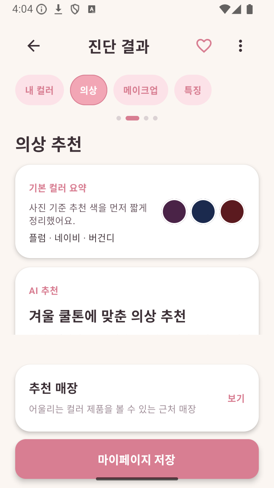</a></td>
    <td align="center"><a href="img/result-ai-makeup.png">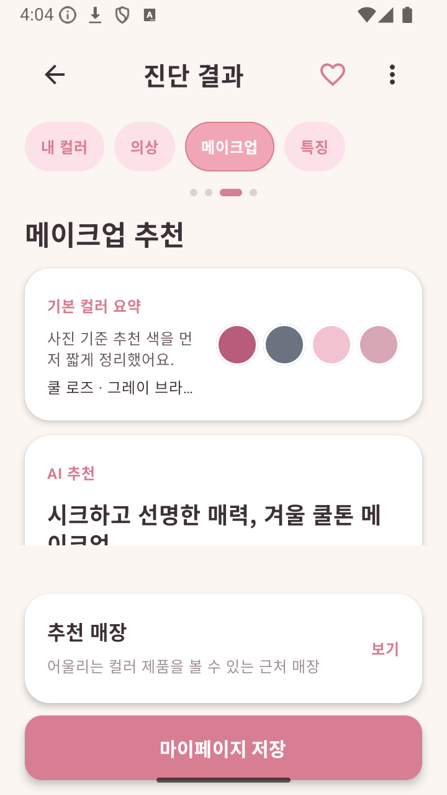</a></td>
    <td align="center"><a href="img/result-products.png">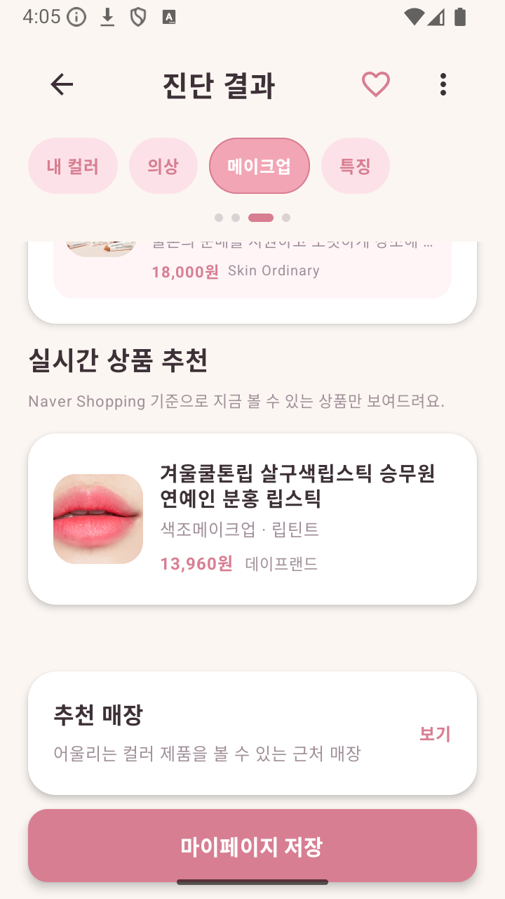</a></td>
  </tr>
  <tr>
    <th>백엔드 OFF 결과</th>
    <th>공유</th>
    <th>리포트 저장 버튼</th>
    <th>저장된 PNG</th>
  </tr>
  <tr>
    <td align="center"><a href="img/result-backend-off.png">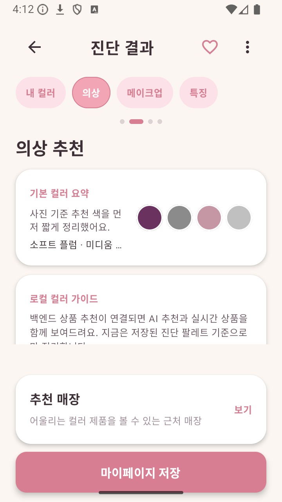</a></td>
    <td align="center"><a href="img/result-share.png"></a></td>
    <td align="center"><a href="img/grading-downloadmanager-report-save-result.png">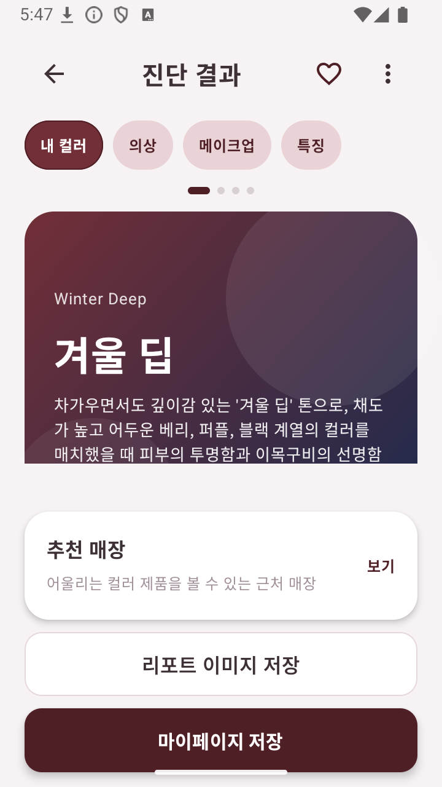</a></td>
    <td align="center"><a href="img/grading-downloadmanager-exported-report.png">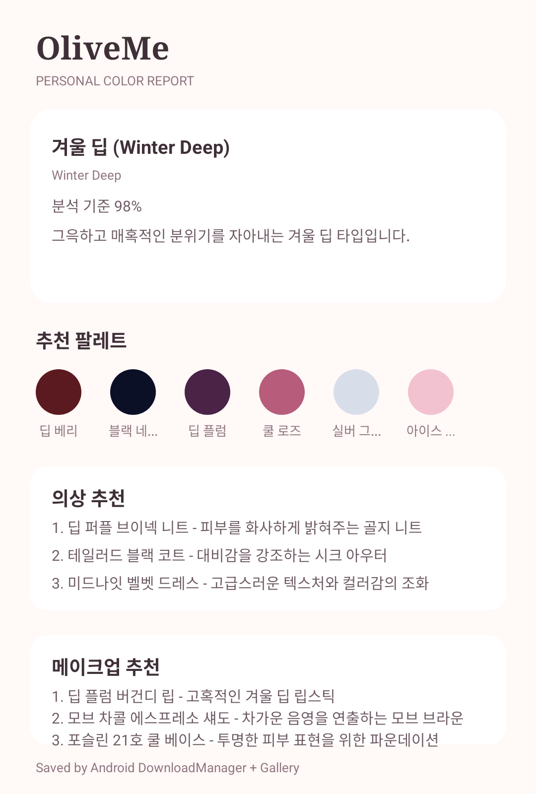</a></td>
  </tr>
</table>

### 3. 지도, 매장, 외부 앱 연동

지도 화면은 Kakao Local 매장 검색 결과를 OSM WebView 지도와 하단 매장 목록에 함께 표시합니다. 지도 이동 후에는 자동으로 목록을 바꾸지 않고 `이 지역 재검색`으로 명시 갱신하며, 선택 매장은 정확한 좌표에 고정합니다. 외부 지도 앱은 Google Maps 앱, 브라우저 fallback, 링크 복사 순서로 방어합니다.

<table>
  <tr>
    <th>지도</th>
    <th>지도 재검색</th>
    <th>지도 클러스터</th>
    <th>저장 필터</th>
  </tr>
  <tr>
    <td align="center"><a href="img/map.png"></a></td>
    <td align="center"><a href="img/map-refresh.png">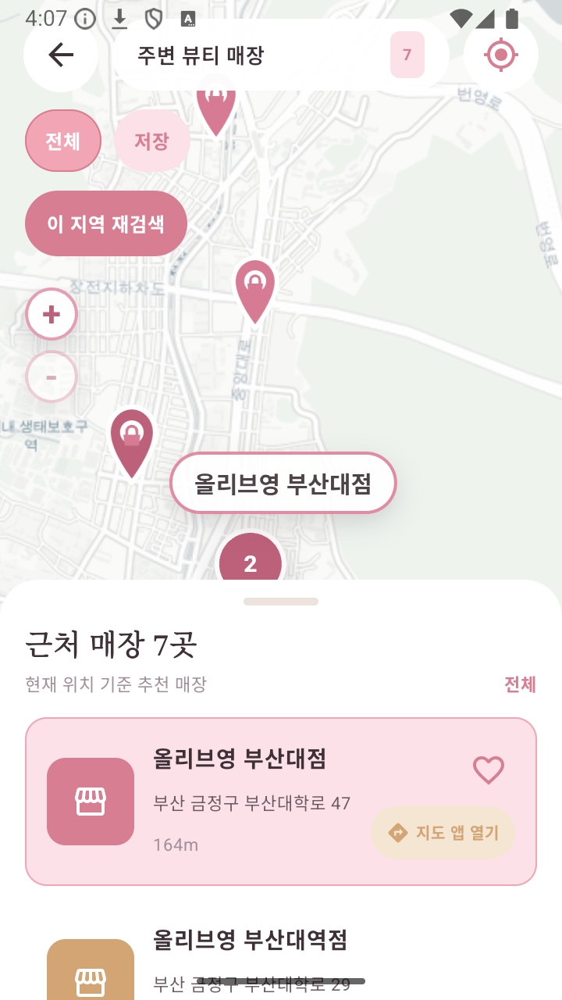</a></td>
    <td align="center"><a href="img/map-cluster.png">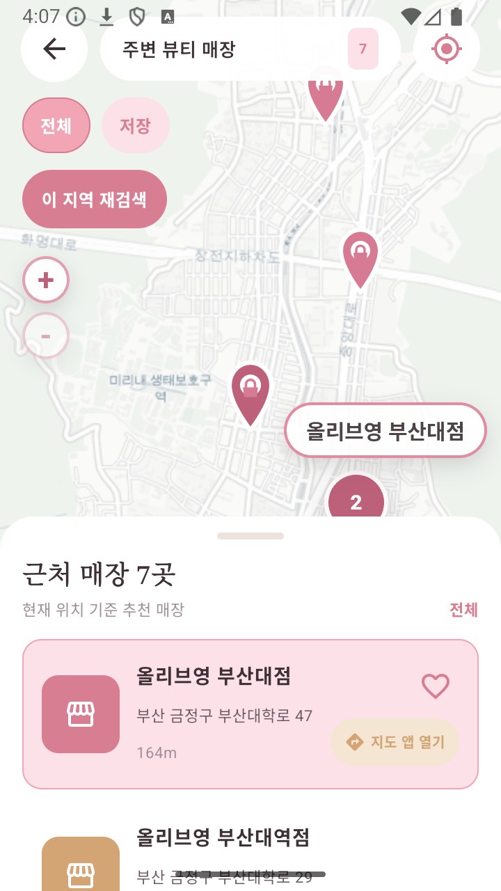</a></td>
    <td align="center"><a href="img/map-saved-filter.png">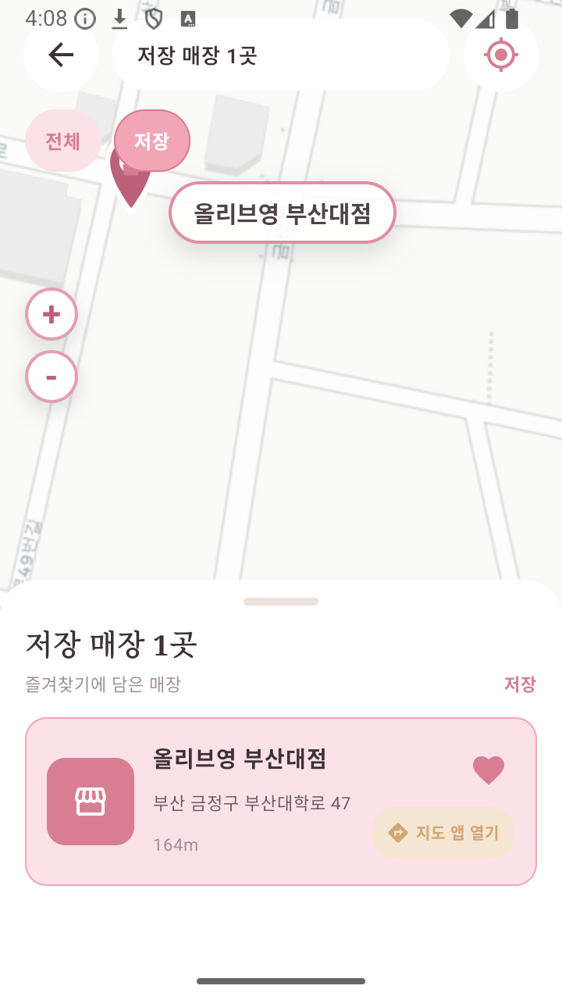</a></td>
  </tr>
  <tr>
    <th>마커 정확도</th>
    <th>Google Maps</th>
    <th>브라우저 fallback</th>
    <th>링크 복사 fallback</th>
  </tr>
  <tr>
    <td align="center"><a href="img/map-marker-accuracy-zoom19.png">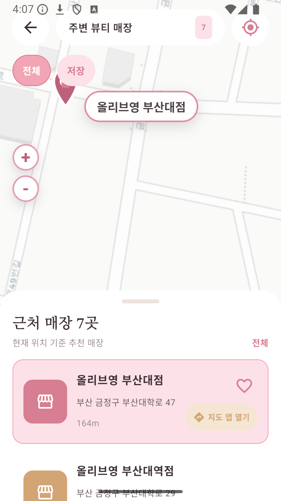</a></td>
    <td align="center"><a href="img/google-maps.png"></a></td>
    <td align="center"><a href="img/map-browser-fallback.png">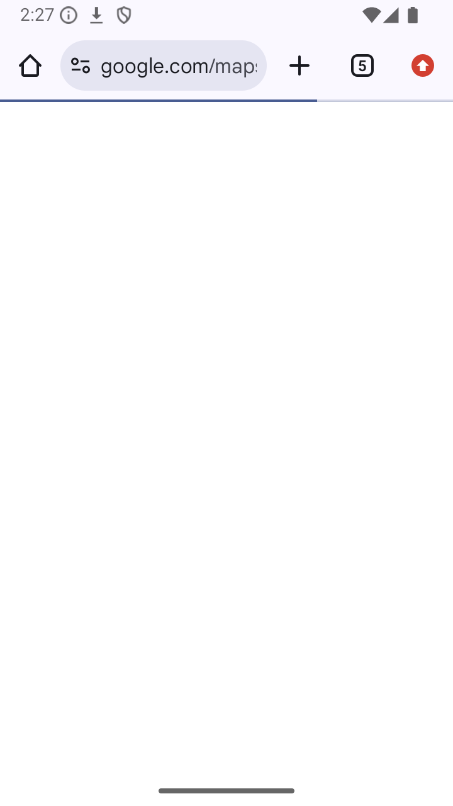</a></td>
    <td align="center"><a href="img/map-link-copy.png">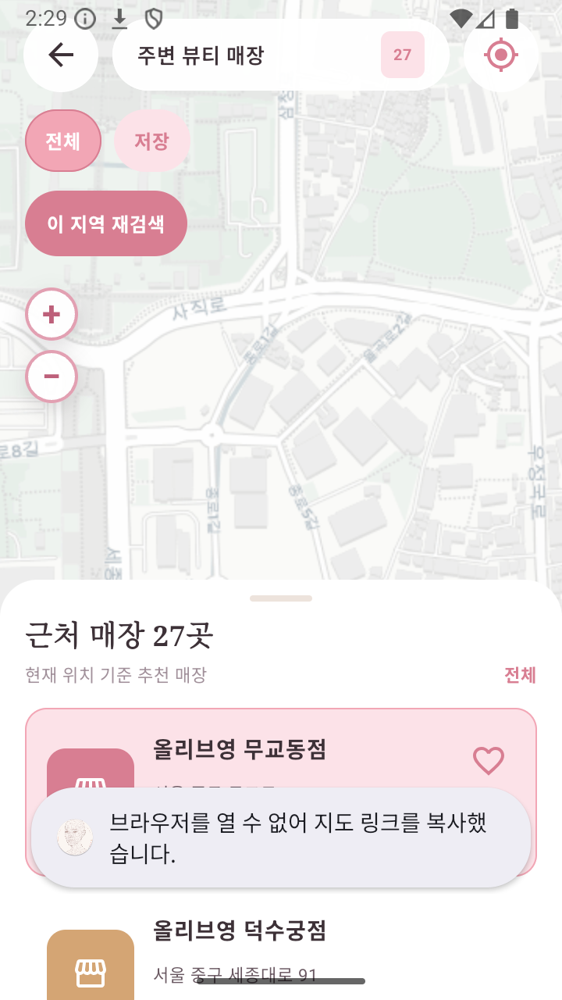</a></td>
  </tr>
</table>

### 4. 마이페이지, 설정, 로컬 저장

마이페이지는 Room DB 기반 진단 이력과 저장 매장을 보여주고, 설정은 테마/데이터 관리/로그아웃 흐름을 제공합니다. 아래 이미지는 DB, 설정/테마, 리포트 이미지 저장 버튼을 함께 보여주는 제출용 증빙입니다.

<table>
  <tr>
    <th>마이페이지</th>
    <th>진단 이력</th>
    <th>저장 매장</th>
    <th>설정/테마</th>
  </tr>
  <tr>
    <td align="center"><a href="img/mypage.png"></a></td>
    <td align="center"><a href="img/mypage-history.png">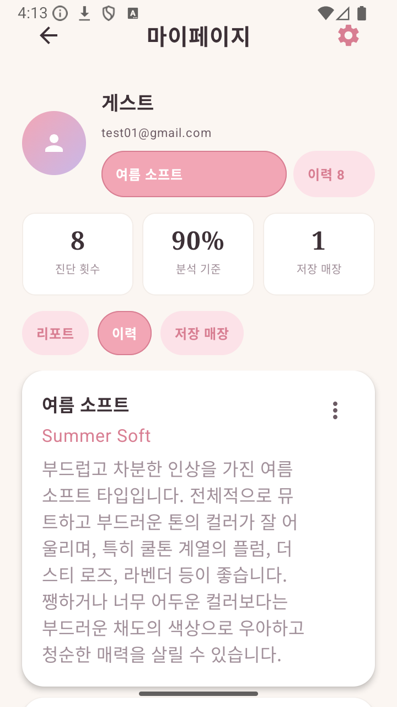</a></td>
    <td align="center"><a href="img/mypage-saved-stores.png">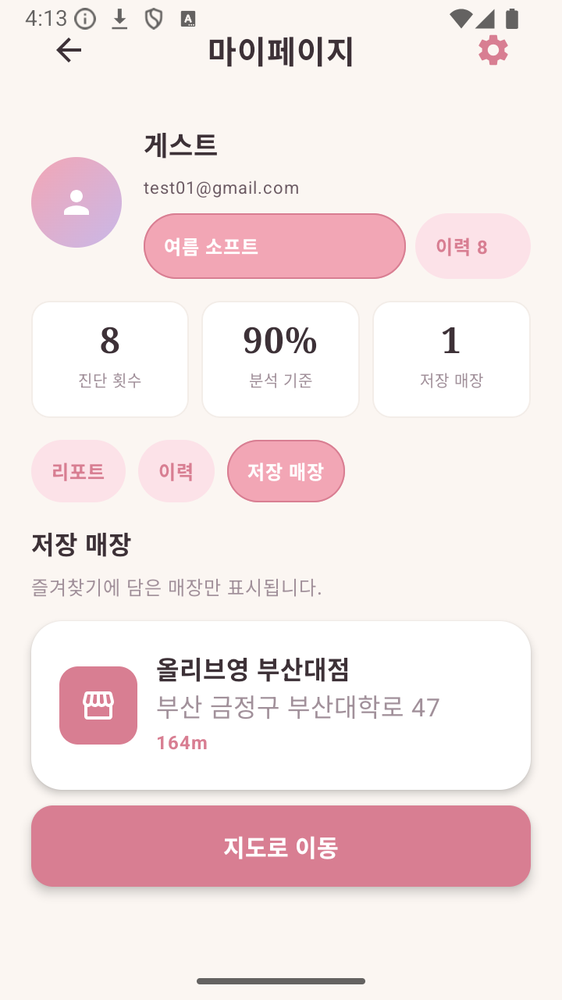</a></td>
    <td align="center"><a href="img/settings-data-actions.png">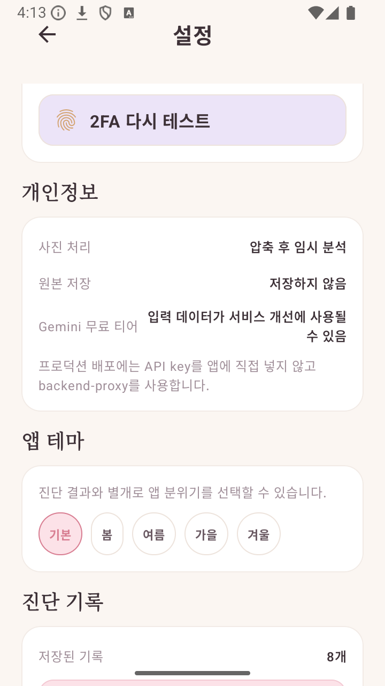</a></td>
  </tr>
  <tr>
    <th>MyPage 저장 버튼</th>
    <th>Result 저장 버튼</th>
    <th>저장된 PNG</th>
    <th>Backend off 안정성</th>
  </tr>
  <tr>
    <td align="center"><a href="img/grading-downloadmanager-report-save-mypage.png">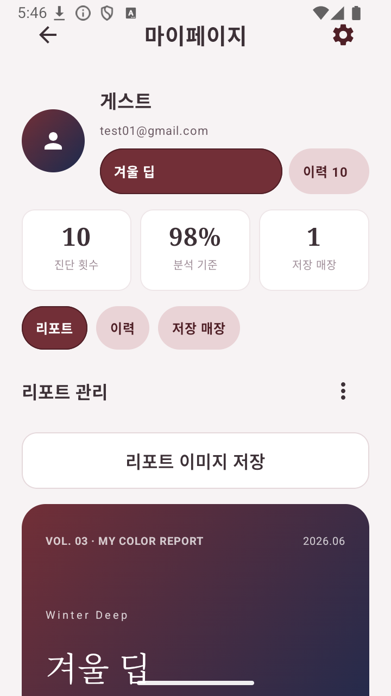</a></td>
    <td align="center"><a href="img/grading-downloadmanager-report-save-result.png"></a></td>
    <td align="center"><a href="img/grading-downloadmanager-exported-report.png"></a></td>
    <td align="center"><a href="img/result-backend-off.png"></a></td>
  </tr>
</table>

### 5. 채점 항목별 증빙 요약

채점 항목별 기능명, 점수 판단, 구현 파일, QA artifact, backend-off 방어 근거는
[`docs/GRADING_FEATURE_EVIDENCE.md`](docs/GRADING_FEATURE_EVIDENCE.md)에 따로 정리했습니다.
아래 표는 발표 중 각 점수 항목을 설명할 때 바로 보여줄 수 있는 핵심 증빙 화면입니다.

<table>
  <tr>
    <th>Coroutine</th>
    <th>DownloadManager</th>
    <th>Jetpack</th>
    <th>Room DB</th>
  </tr>
  <tr>
    <td align="center"><a href="img/diagnosis-analyzing.png"></a></td>
    <td align="center"><a href="img/grading-downloadmanager-report-save-mypage.png"></a></td>
    <td align="center"><a href="img/main.png"></a></td>
    <td align="center"><a href="img/mypage-history.png"></a></td>
  </tr>
  <tr>
    <th>외부 앱</th>
    <th>API</th>
    <th>ML</th>
    <th>안정성</th>
  </tr>
  <tr>
    <td align="center"><a href="img/diagnosis-source-sheet.png">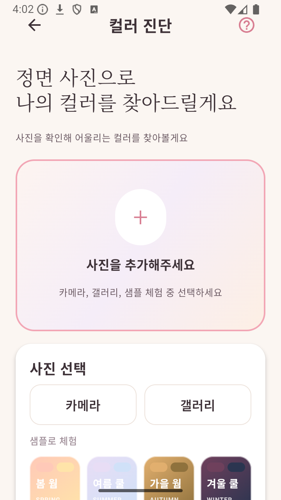</a></td>
    <td align="center"><a href="img/result-products.png"></a></td>
    <td align="center"><a href="img/grading-ml-tflite-2fa.png">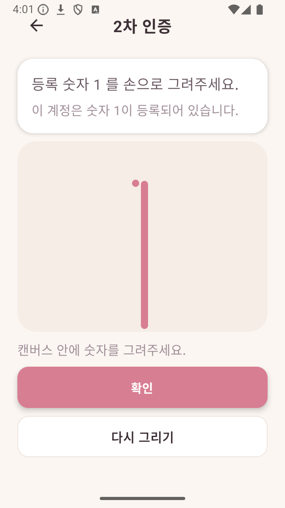</a></td>
    <td align="center"><a href="img/result-backend-off.png"></a></td>
  </tr>
  <tr>
    <th>Kakao Local 지도</th>
    <th>저장 매장</th>
    <th>마커 정확도</th>
    <th>설정/테마</th>
  </tr>
  <tr>
    <td align="center"><a href="img/map.png"></a></td>
    <td align="center"><a href="img/map-saved-filter.png"></a></td>
    <td align="center"><a href="img/map-marker-accuracy-zoom19.png"></a></td>
    <td align="center"><a href="img/settings-data-actions.png"></a></td>
  </tr>
</table>

### 채점 기준별 구현 요약

| 기준 | 앱에서 보이는 기능 | 구현 설명 |
| --- | --- | --- |
| Coroutine | 로그인, 진단 중 화면, 지도/상품 로딩 | ViewModel의 `viewModelScope`와 `Dispatchers.IO`로 DB, API, 이미지 저장, ML 처리를 UI 멈춤 없이 실행합니다. 실패하면 화면 state나 toast로 복구합니다. |
| 다운로드/API 매니저 | 상품 썸네일, 리포트 이미지 저장 | Retrofit/OkHttp가 Gemini/Kakao/backend API를 관리하고, Glide가 Naver 상품 이미지를 다운로드/캐시합니다. Result와 MyPage의 `리포트 이미지 저장`은 Android OS `DownloadManager`에 PNG 리포트를 등록하고 갤러리 `Pictures/OliveMe`에도 저장합니다. |
| Jetpack | 전체 Compose 화면, 이력/저장 데이터 | Compose, Room, ViewModel/Lifecycle, ActivityResult API를 실제 화면 흐름에 사용합니다. 채점 기준에 맞춰 RecyclerView/Fragment/ViewPager2/DrawerLayout 증빙 레이어도 별도 보유합니다. |
| 외부 앱 연동 | 갤러리/카메라, 공유, 지도 앱 열기 | 갤러리 사진 선택, 카메라 preview, Android 공유 chooser, Google Maps 앱과 브라우저 fallback을 연결합니다. 외부 앱이 없으면 toast나 링크 복사로 종료 없이 처리합니다. |
| DB | 마이페이지 이력, 저장 매장, 2FA 설정 | Room 로컬 DB에 사용자, 동의, 2FA, 진단 이력, 추천 컬러/상품, 즐겨찾기 매장을 저장합니다. 외부 DB API와 중복 점수로 설명하지 않고 내부 DB 기능으로 설명합니다. |
| API | AI 진단, 로그인, 매장, 상품 추천 | Gemini, Kakao Login, Kakao Local, Naver Shopping backend proxy, OSM 지도 타일, Google Maps 외부 Intent를 기능별로 분리해 사용합니다. API가 꺼져도 로컬 진단/seed 매장/컬러 가이드로 복구합니다. |
| 머신러닝 | 손글씨 숫자 2차 인증 | 앱 내 `digit_mnist.tflite`를 TensorFlow Lite Interpreter로 실행해 숫자 `1` 손글씨를 판별합니다. 모델 로드 실패나 빈 캔버스는 재시도 상태로 처리합니다. |
| 안정성/완성도 | backend-off 결과, 권한 거부, 저장 실패 방어 | 권한 거부, API timeout, backend off, 이미지 실패, 외부 앱 없음, DownloadManager 실패를 모두 crash 없이 안내/fallback으로 흡수합니다. 최종 QA는 `logcat -b crash` 0 lines 기준으로 기록합니다. |

## 주요 기능

- **계정 시작과 통합 동의**: 이메일/게스트 흐름을 제공하고, 서비스 이용약관·개인정보·위치/사진 처리·AI 분석·상품 추천 고지를 스크롤형 동의 화면으로 확인합니다.
- **손글씨 2차 인증**: 테스트 계정은 숫자 `1`을 손으로 그려 인증합니다. 빈 캔버스나 실패 상황에서도 앱은 종료되지 않고 재시도 상태로 복구됩니다.
- **사진 기반 컬러 진단**: 카메라, 갤러리, 샘플 사진 흐름을 제공하고, preview 단계에서 조명·초점·품질 안내를 표시합니다.
- **Gemini 분석과 fallback**: Gemini API를 우선 사용하되, 네트워크/쿼터/JSON 오류가 나도 로컬 템플릿과 사진 품질 정보로 결과 화면까지 자연스럽게 이어집니다.
- **결과 리포트**: 퍼스널 컬러 타입, 추천 팔레트, 피하면 좋은 색, 의상·메이크업·특징 탭, 저장/공유/마이페이지 저장 흐름을 제공합니다. `리포트 이미지 저장`은 Android OS `DownloadManager`에 PNG 리포트를 등록하고 `Pictures/OliveMe` 갤러리에도 내보냅니다.
- **지도와 매장 연결**: 앱 내부 지도는 OSM WebView 기반으로 동작합니다. 상단은 검색창이 아니라 `주변 뷰티 매장` 상태 헤더이며, 지도 이동/확대 후 `이 지역 재검색`을 눌렀을 때만 Kakao Local이 노출하는 최대 45개 매장을 다시 불러옵니다. 지도는 최소 zoom 14에서 더 이상 축소되지 않아 너무 넓은 영역을 억지로 표시하지 않습니다. 하단 매장 목록은 드래그 핸들로 높이를 조절할 수 있습니다. 선택 매장의 `지도 앱 열기`는 Google Maps 앱, 브라우저, 링크 복사 순으로 fallback됩니다. 지도는 정적 Leaflet shell을 한 번 로드한 뒤 매장 payload만 갱신하고, 로딩 중 빈 결과를 먼저 보여주지 않으며, 선택 라벨을 sheet 위에 유지합니다. debounce와 viewport 근처 마커 렌더링으로 WebView 부담을 줄입니다.
- **마이페이지와 설정**: 저장된 리포트, 진단 이력, 즐겨찾기 매장, 테마/보안/개인정보/앱 정보 설정을 한곳에서 관리합니다.
- **선택형 커머스 추천**: backend-proxy가 켜져 있으면 Result 의상/메이크업 탭에서 기본 컬러 요약 다음에 AI 추천, AI가 고른 상품, 실시간 Naver Shopping 상품을 먼저 보여주고, 상세 컬러 분석은 아래에서 이어 봅니다. 메이크업은 립/아이/베이스/치크가 한쪽으로 몰리지 않도록 백엔드에서 균형 검색하고, 백엔드가 없으면 로컬 컬러 가이드만 표시합니다.

## 기술 스택

- **Android**: Kotlin, Jetpack Compose, Activity/Intent, ViewModel
- **Jetpack/AndroidX**: Room, Lifecycle, Coroutine, DrawerLayout/ViewPager2/Fragment/RecyclerView 채점 증빙 레이어
- **Network**: Retrofit, Gson, Gemini Developer API, Kakao Local API, backend-proxy optional API
- **ML**: TFLite MNIST 손글씨 숫자 인식, 사진 품질 분석 fallback
- **Map**: OSM WebView 지도, Google Maps 외부 Intent
- **Download/Image**: Android OS DownloadManager 리포트 이미지 저장, Glide 상품 이미지 다운로드/캐시, Android image loader/downsample 방어
- **Backend Proxy**: Node.js/Express, Naver Shopping 상품 추천, Gemini commerce summary와 quota fallback 구조

## 협업 및 역할 분담

OliveMe는 2명이 공평하게 기획, 개발, 검수, 발표 준비를 나누어 진행한 공동 프로젝트입니다. 두 팀원 모두 앱 개발에 참여했고, 작업은 화면·자료·기술 영역에 따라 나누었습니다.

- **wannagola**: 아이디어 기획, 사용자 시나리오, PPT/발표 흐름, 디자인 방향 정리, HTML 기준 화면 대조, Login/Main/Result/MyPage 중심 Compose UI polish.
- **robinhood0107**: Android 구조, Activity/Intent 연결, ViewModel/Repository/Room, Gemini/Kakao/TFLite/지도/backend proxy 연동, 오류 방어, Test Android Apps QA와 GitHub 운영.
- **공통**: 진실 명세서 검토, 채점 기준 증빙, 시연 리허설, PR 리뷰.

## 실행 방법

Android 프로젝트는 `android/` 아래에 있습니다.

```bash
cd android
./gradlew testDebugUnitTest
./gradlew assembleDebug
```

Windows에서는 다음처럼 실행합니다.

```bat
cd /d C:\Users\pjjpj\Desktop\personal_color_app\android
gradlew.bat :app:testDebugUnitTest :app:assembleDebug
```

에뮬레이터에 설치하려면 기기가 연결된 상태에서 다음을 사용합니다.

```bash
adb devices
adb install -r android/app/build/outputs/apk/debug/app-debug.apk
adb shell am start -n com.oliveme.app/.LoginActivity
```

## 백엔드 프록시

`backend-proxy/`는 Gemini, Naver, Coupang, FCM 같은 민감 키를 APK에 직접 넣지 않기 위한 production-shape proxy입니다. 현재 앱은 결과 화면의 선택형 커머스/Naver 추천 섹션에서만 프록시를 사용합니다.

로컬 에뮬레이터에서 Windows 백엔드를 볼 때는 다음을 사용합니다.

```bash
adb reverse tcp:8787 tcp:8787
```

백엔드가 꺼져 있거나 `BACKEND_BASE_URL`에 접근할 수 없으면 커머스 섹션은 조용히 숨겨지고, 진단·결과·지도·마이페이지는 계속 정상 동작합니다.

## 비밀값 관리

실제 API key는 커밋하지 않습니다. 로컬에서만 다음 파일에 둡니다.

- Android: `android/local.properties`
- Backend: `backend-proxy/.env`

필요한 Android 값은 `android/local.properties.example`을 복사해 채웁니다.

```properties
GEMINI_API_KEY=
KAKAO_NATIVE_APP_KEY=
KAKAO_REST_API_KEY=
BACKEND_BASE_URL=http://127.0.0.1:8787/
```

`local.properties`, `.env*`, keystore, build output, `.gstack/`, `plan/`은 git에 올리지 않습니다.
