# OliveMe

> 사진 한 장으로 퍼스널 컬러를 진단하고, 팔레트·의상·메이크업·주변 매장·상품 추천까지 이어주는 Android Kotlin 앱입니다.

[](img/app-icon.png)

## 프로젝트 소개

OliveMe는 얼굴 또는 상반신 사진을 기반으로 퍼스널 컬러 타입을 분석하고, 사용자가 바로 활용할 수 있는 컬러 가이드와 추천 흐름을 제공합니다. 앱은 Android Kotlin과 Jetpack Compose로 구현되어 있으며, 외부 API가 실패하거나 백엔드가 꺼져 있어도 seed 데이터와 로컬 fallback으로 종료 없이 동작하도록 설계했습니다.

핵심 목표는 단순한 화면 시연이 아니라 실제 앱처럼 안전하게 흐르는 경험입니다. 로그인, 통합 동의, 손글씨 2차 인증, 사진 진단, Gemini 분석/fallback, 결과 저장, OSM 지도, Google Maps 외부 연결, 마이페이지, 설정, 선택형 커머스 추천까지 하나의 사용자 여정으로 연결됩니다.

## 스크린샷

각 이미지는 실제 Android emulator에서 `Test Android Apps` 방식으로 캡처했습니다. 이미지를 누르면 원본 크기로 볼 수 있습니다.

| 시작 | 로그인 | 동의 | 2차 인증 |
| --- | --- | --- | --- |
| [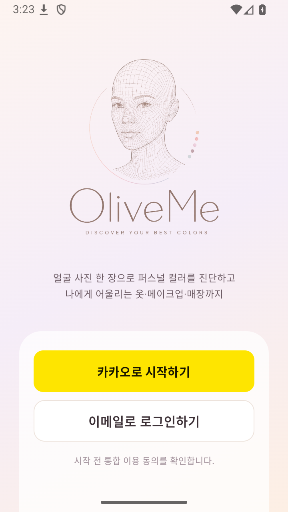](img/login.png) | [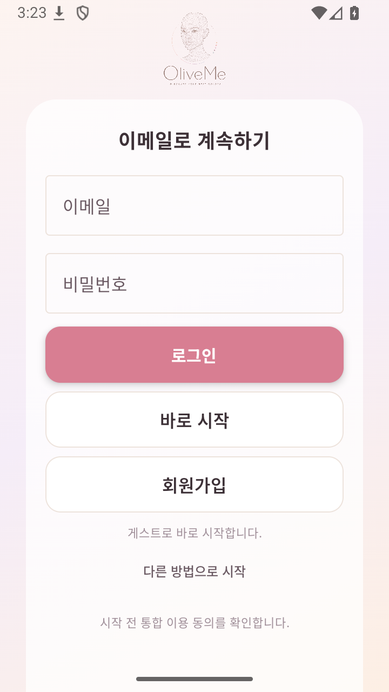](img/email-login.png) | [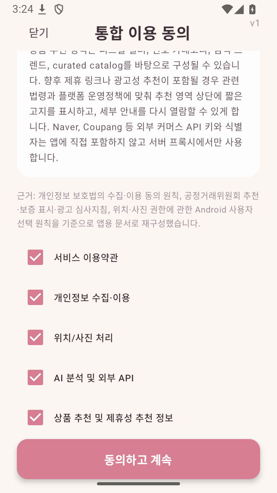](img/legal-consent.png) | [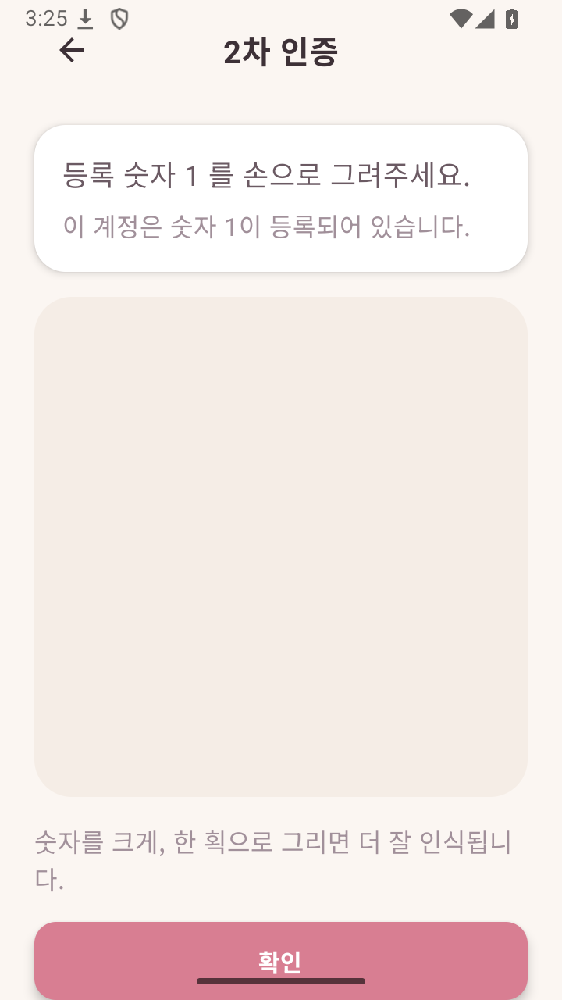](img/2fa.png) |

| 홈 | 진단 시작 | 사진 확인 | 분석 중 |
| --- | --- | --- | --- |
| [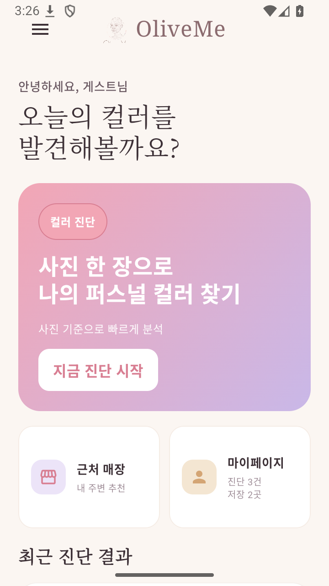](img/main.png) | [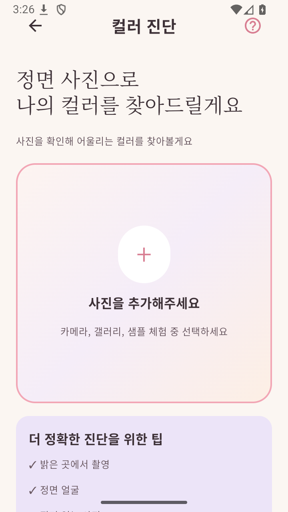](img/diagnosis.png) | [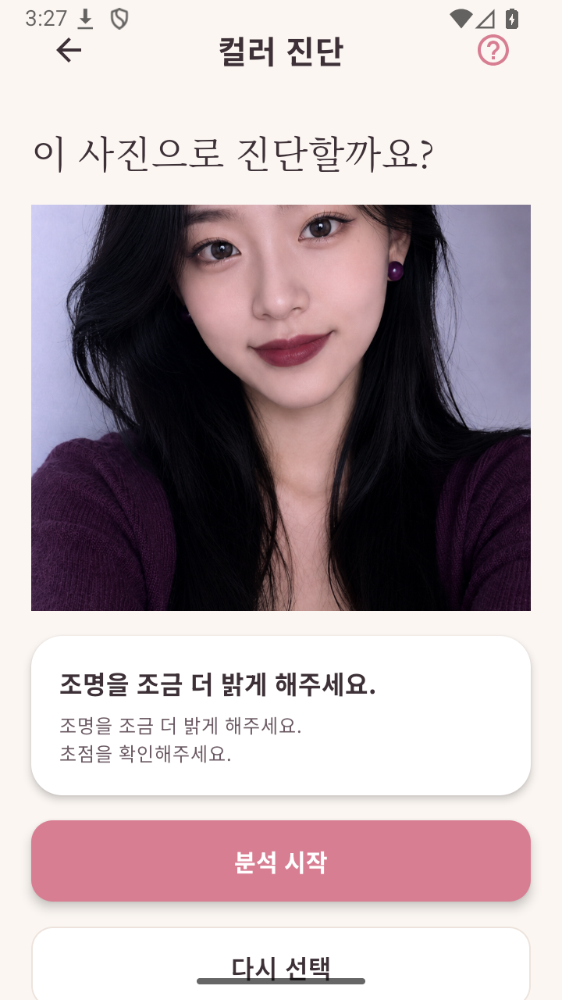](img/diagnosis-preview.png) | [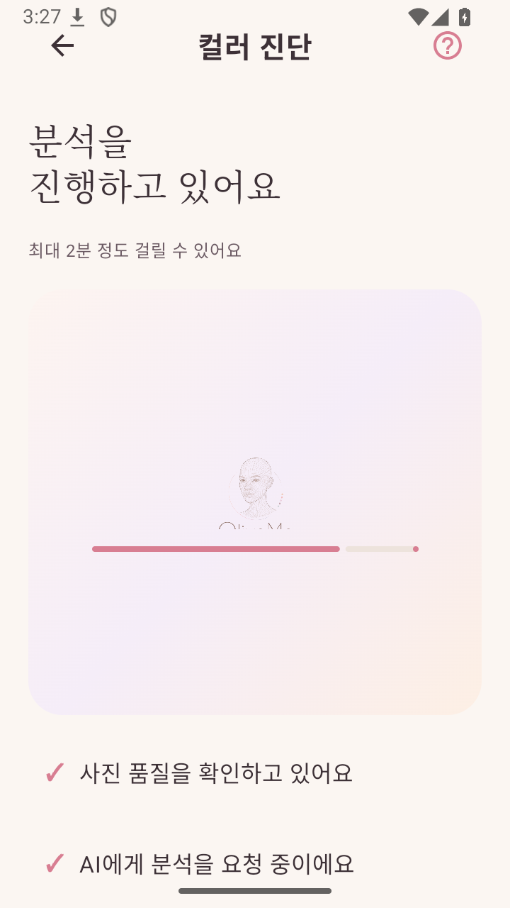](img/diagnosis-analyzing.png) |

| 결과 | 지도 | Google Maps 연결 | 마이페이지 |
| --- | --- | --- | --- |
| [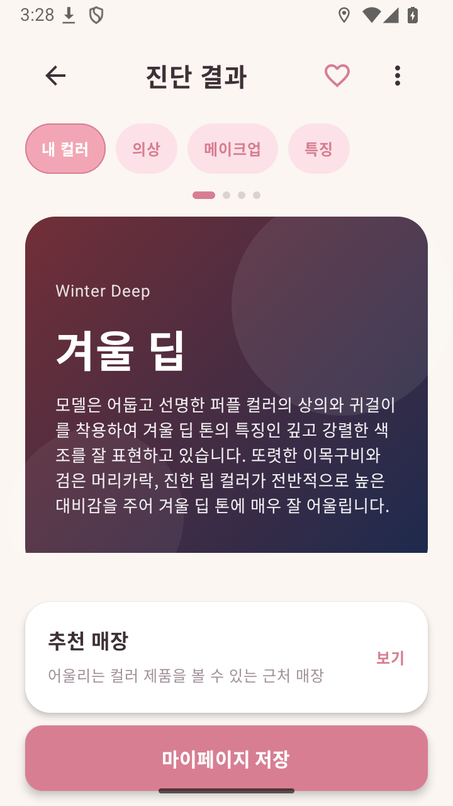](img/result.png) | [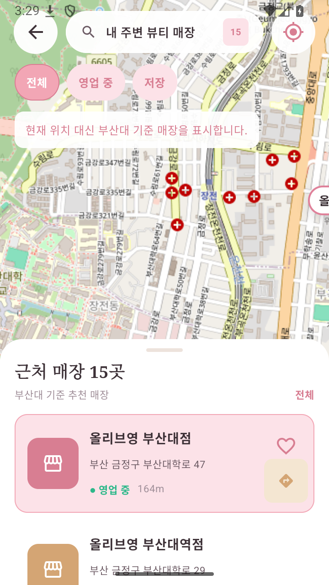](img/map.png) | [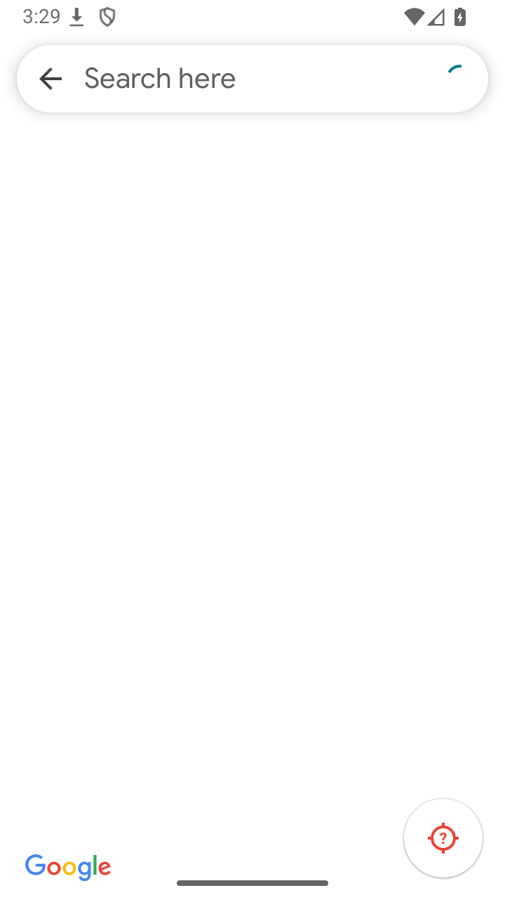](img/google-maps.png) | [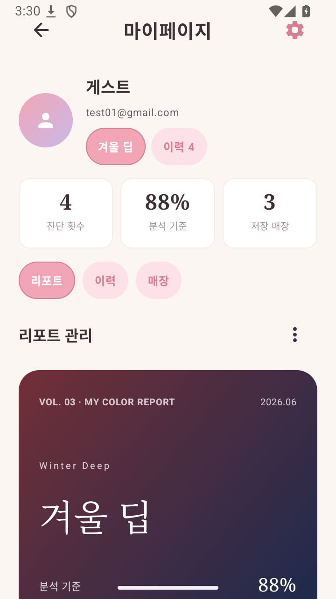](img/mypage.png) |

| 설정 |
| --- |
| [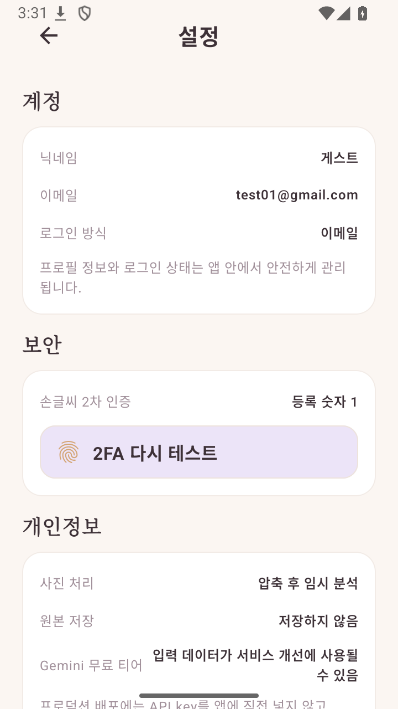](img/settings.png) |

## 주요 기능

- **계정 시작과 통합 동의**: 이메일/게스트 흐름을 제공하고, 서비스 이용약관·개인정보·위치/사진 처리·AI 분석·상품 추천 고지를 스크롤형 동의 화면으로 확인합니다.
- **손글씨 2차 인증**: 테스트 계정은 숫자 `1`을 손으로 그려 인증합니다. 빈 캔버스나 실패 상황에서도 앱은 종료되지 않고 재시도 상태로 복구됩니다.
- **사진 기반 컬러 진단**: 카메라, 갤러리, 샘플 사진 흐름을 제공하고, preview 단계에서 조명·초점·품질 안내를 표시합니다.
- **Gemini 분석과 fallback**: Gemini API를 우선 사용하되, 네트워크/쿼터/JSON 오류가 나도 로컬 템플릿과 사진 품질 정보로 결과 화면까지 자연스럽게 이어집니다.
- **결과 리포트**: 퍼스널 컬러 타입, 추천 팔레트, 피하면 좋은 색, 의상·메이크업·특징 탭, 저장/공유/마이페이지 저장 흐름을 제공합니다.
- **지도와 매장 연결**: 앱 내부 지도는 OSM WebView 기반으로 동작하고, 매장 길찾기는 Google Maps 앱으로 연결됩니다. 위치 권한을 거부해도 부산대 기준 추천 매장 fallback이 표시됩니다.
- **마이페이지와 설정**: 저장된 리포트, 진단 이력, 즐겨찾기 매장, 테마/보안/개인정보/앱 정보 설정을 한곳에서 관리합니다.
- **선택형 커머스 추천**: backend-proxy가 켜져 있으면 Naver Shopping 기반 상품 썸네일과 AI 추천 요약을 표시하고, 백엔드가 꺼져 있으면 해당 섹션을 조용히 숨깁니다.

## 기술 스택

- **Android**: Kotlin, Jetpack Compose, Activity/Intent, ViewModel
- **Jetpack/AndroidX**: Room, Lifecycle, Coroutine, DrawerLayout/ViewPager2/Fragment/RecyclerView 채점 증빙 레이어
- **Network**: Retrofit, Gson, Gemini Developer API, Kakao Local API, backend-proxy optional API
- **ML**: TFLite MNIST 손글씨 숫자 인식, 사진 품질 분석 fallback
- **Map**: OSM WebView 지도, Google Maps 외부 Intent
- **Image**: Glide, Android image loader/downsample 방어
- **Backend Proxy**: Node.js/Express, Naver Shopping/Gemini commerce summary 준비 구조

## 앱 아이콘 경로

현재 Android launcher icon은 adaptive icon XML이 foreground PNG와 배경색을 조합하는 구조입니다.

- 런처 아이콘 XML: `android/app/src/main/res/mipmap-anydpi-v26/ic_launcher.xml`
- 원형 런처 아이콘 XML: `android/app/src/main/res/mipmap-anydpi-v26/ic_launcher_round.xml`
- 런처 foreground 이미지: `android/app/src/main/res/drawable-nodpi/ic_launcher_foreground_logo.png`
- 런처 배경색: `android/app/src/main/res/values/colors.xml`의 `ic_launcher_background`
- 앱 내부 full 로고: `android/app/src/main/res/drawable-nodpi/oliveme_logo.png`
- 앱 내부 mark 로고: `android/app/src/main/res/drawable-nodpi/oliveme_mark.png`

Manifest의 앱 표시 이름은 `android:label="OliveMe"`입니다.

## 실행 방법

Android 프로젝트는 `android/` 아래에 있습니다.

```bash
cd android
./gradlew testDebugUnitTest
./gradlew assembleDebug
```

Windows에서는 다음처럼 실행합니다.

```bat
cd /d C:\Users\pjjpj\Desktop\personal_color_app\android
gradlew.bat :app:testDebugUnitTest :app:assembleDebug
```

에뮬레이터에 설치하려면 기기가 연결된 상태에서 다음을 사용합니다.

```bash
adb devices
adb install -r android/app/build/outputs/apk/debug/app-debug.apk
adb shell am start -n com.oliveme.app/.LoginActivity
```

## 백엔드 프록시

`backend-proxy/`는 Gemini, Naver, Coupang, FCM 같은 민감 키를 APK에 직접 넣지 않기 위한 production-shape proxy입니다. 현재 앱은 결과 화면의 선택형 커머스/Naver 추천 섹션에서만 프록시를 사용합니다.

로컬 에뮬레이터에서 Windows 백엔드를 볼 때는 다음을 사용합니다.

```bash
adb reverse tcp:8787 tcp:8787
```

백엔드가 꺼져 있거나 `BACKEND_BASE_URL`에 접근할 수 없으면 커머스 섹션은 조용히 숨겨지고, 진단·결과·지도·마이페이지는 계속 정상 동작합니다.

## 비밀값 관리

실제 API key는 커밋하지 않습니다. 로컬에서만 다음 파일에 둡니다.

- Android: `android/local.properties`
- Backend: `backend-proxy/.env`

필요한 Android 값은 `android/local.properties.example`을 복사해 채웁니다.

```properties
GEMINI_API_KEY=
KAKAO_NATIVE_APP_KEY=
KAKAO_REST_API_KEY=
BACKEND_BASE_URL=http://127.0.0.1:8787/
```

`local.properties`, `.env*`, keystore, build output, `.gstack/`, `plan/`은 git에 올리지 않습니다.

## QA 결과

최종 스크린샷 QA는 `Test Android Apps`의 `android-emulator-qa` 지침에 맞춰 진행했습니다.

- Artifact: `/tmp/oliveme-portfolio-qa-20260604-121948`
- Emulator: `Small_Phone_API_36`, `720x1280`
- Package: `com.oliveme.app`
- Launch Activity: `com.oliveme.app/.LoginActivity`
- Crash buffer: `0 lines`
- 저장된 증빙: screenshot, UI tree XML, UI summary, logcat, crash buffer, gfxinfo framestats

검증한 흐름:

- 로그인 시작, 이메일 sheet, 게스트 시작, 통합 이용 동의
- 2FA 빈 캔버스 실패 안내, 숫자 `1` 입력 성공
- 메인 화면, 권한 온보딩 거부 fallback
- 진단 시작, 샘플 사진 선택, 사진 preview, 품질 안내, 분석 대기
- 결과 자동 이동, 탭 전환, 저장, 추천 매장 진입
- OSM 지도 표시, 위치 권한 거부 fallback, 즐겨찾기, Google Maps 길찾기 Intent
- 마이페이지 리포트/이력/매장 탭, 설정 화면 진입

Android Studio가 열린 상태에서 Gradle intermediate 파일이 잠길 수 있어 설치 QA는 기존 `assembleDebug` 산출물 APK를 `adb install -r`로 설치해 진행했습니다. 앱 실행 중 crash buffer는 비어 있었고, 사용자 흐름은 정상 완료되었습니다.

## 기준 문서

- 단일 진실 명세서: `docs/TRUTH_SPEC.md`
- 퍼스널 컬러 진단 기준: `docs/PERSONAL_COLOR_DIAGNOSIS_METHOD.md`
- Android QA 증빙: `docs/QA_EVIDENCE.md`
- 디자인 원본: `Personalcolor design/`
