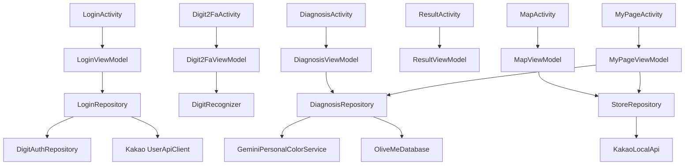

# OliveMe 단일 진실 명세서

버전: 2026-06-01
상태: 현재 구현 사실 + HTML 1:1 목표 기준 문서
적용 범위: `android/` Android 앱, GitHub 운영 하네스, 디자인 구현, 오류 방어, 발표/채점 증빙

## 1. 목표와 불변 규칙

OliveMe는 사용자가 얼굴 사진을 선택하거나 촬영하면 Gemini Vision 기준의 퍼스널 컬러 분석을 수행하고, 어울리는 의류·메이크업 색상과 가까운 뷰티 매장을 추천하는 Android Kotlin 앱이다. 최종 목표는 `Personalcolor design/`의 HTML/JSX/CSS 프로토타입과 화면 구조, 버튼 흐름, 상호작용 톤을 최대한 1:1로 맞추는 것이다.

이 문서는 두 기준을 분리한다.

- **현재 구현 사실**: 지금 Android 코드가 실제로 수행하는 동작이다. 완료 기능처럼 말할 수 있는 것은 이 항목뿐이다.
- **HTML 1:1 목표**: `Personalcolor design/`에 이미 존재하지만 Android 구현이 아직 따라가야 하는 동작이다. PR과 issue로 추적한다.

불변 규칙:

- 앱 이름은 `OliveMe`, Android `applicationId`는 `com.oliveme.app`이다.
- Android 프로젝트는 repo 루트가 아니라 `android/` 하위에 둔다.
- `docs/TRUTH_SPEC.md`가 단 하나의 진실 명세서다.
- 모든 에이전트는 `AGENTS.md`를 기본 하네스로 읽고, 이 문서를 최우선 기준으로 삼는다.
- `CLAUDE.md`는 Claude 호환용 보조 문서이며 기본 운영 기준이 아니다.
- `plan/`은 참고 자료로만 사용하고 git에 올리지 않는다.
- `Personalcolor design/`은 디자인 원본이므로 git에는 추적하되 Android 구현 중 수정하지 않는다.
- 구현은 `dev` 브랜치에 먼저 올리고 검수 후 PR로 `main`에 병합한다.
- 중대한 변경, 보안/설계 검토, 채점 리스크, HTML parity 미달 항목은 GitHub issue로 흔적을 남기고 PR에서 닫는다.
- 오류 발생으로 앱이 종료되면 안정성 0점 리스크가 있으므로 모든 외부 실패는 안내 메시지와 fallback 상태로 전환한다.

### 1.1 UI 감축 및 접근성 원칙

2026-06-01 이후 UI 정리 작업의 기준은 "기능 삭제 없이 노출 밀도만 낮추기"다. 사용자가 보는 버튼 수는 줄이되, 기존 기능은 반드시 `bottom sheet`, `overflow`, `selected card`, `settings`, `toast action`, 명확한 화면 이동 중 하나로 접근 가능해야 한다.

- 화면당 primary CTA는 1개를 기본값으로 한다.
- 보조 CTA는 최대 1개만 상시 노출한다.
- 세 번째 이후 기능은 sheet, overflow, 선택된 카드, 설정 화면으로 접는다.
- 숨긴 기능은 버튼 매트릭스에 새 접근 경로를 기록한다.
- `준비 중입니다`만 표시하는 버튼은 사용자 화면에서 숨기거나 설정/정보 항목으로 이동한다.
- 사용자는 주요 기능에 최대 2-3번 탭 안에 도달해야 한다.
- 모든 icon button은 `contentDescription`과 실제 이벤트를 가진다.

사용자 화면 금지 문구:

- `Gemini 실패`
- `sample fallback`
- `샘플 리포트`
- `모델 준비 전 데모 통과`
- `S1`, `S2`, `S3`, `S4`
- 근거 없는 고정 시간 문구인 `18초`
- 근거 없는 고정 성능 문구인 `정확도 92%`

허용 대체 문구:

- `데모 결과로 이어서 보여드릴게요`
- `최근 리포트`
- `샘플로 체험`
- `컬러를 정리하고 있어요`
- `부산대 기준 추천 매장`

## 2. 입력 자료에서 확정된 요구사항

### 2.1 과제 및 채점 기준

`plan/` 자료와 강의/채점 기준에서 확인한 증빙 요구사항:

| 항목 | 현재 구현/증빙 기준 |
| --- | --- |
| Activity 3개 이상 + Intent | `LoginActivity`, `Digit2FaActivity`, `MainActivity`, `DiagnosisActivity`, `ResultActivity`, `MapActivity`, `MyPageActivity`; `IntentKeys`로 user/result extra 전달 |
| Coroutine | `viewModelScope`, `suspend`, `withContext(Dispatchers.IO)` |
| 다운로드/API 매니저 | Retrofit API service, Glide dependency |
| Jetpack 3개 이상 | Room, Compose, ViewModel, plus `LegacyJetpackEvidence`로 ViewPager2/Fragment/RecyclerView/DrawerLayout 증빙 |
| 외부 앱 연동 | 갤러리 선택, 카메라 preview, share Intent 목표 |
| API 3개 이상 | Gemini, Kakao Login, Kakao Local/Map |
| DB | Room: user, digit auth, diagnosis history, colors, products, favorite stores |
| ML 모델 | 직접 학습한 MNIST TFLite digit model asset |
| 안정성 | 모든 취소/권한/API/model 실패를 crash-free fallback으로 처리 |
| 완성도 | HTML 기준 버튼/탭/지도/마이페이지/저장/공유 동작을 구현 목표로 추적 |

중요: `LegacyJetpackEvidence`는 채점 증빙용 숨은/보조 Android View 계층이다. 현재 사용자 화면의 결과 탭은 user-visible `ViewPager2`가 아니라 Compose tab state로 동작한다.

### 2.2 공식 문서 기반 API 기준

- Gemini Developer API는 `generateContent`를 사용한다.
- 모델 기본값은 `gemini-3.5-flash`이다.
- 이미지 입력은 Base64 inline 방식이다.
- Gemini API key는 Google AI Studio/Google Cloud project에 속한다.
- Gemini 무료 티어는 입력 데이터가 제품 개선에 사용될 수 있으므로 개인정보 안내에 반영한다.
- Kakao Login은 Android manifest auth scheme/activity와 nullable user info 방어가 필요하다.
- Kakao Local keyword search는 REST API key를 `Authorization: KakaoAK ...` 헤더로 보낸다.
- Kakao Map SDK 또는 Local API 실패 시 mock map/sample store card로 대체한다.

## 3. Git, 브랜치, 하네스

### 3.1 브랜치 정책

- 로컬과 원격 브랜치는 `main`, `dev`만 허용한다.
- 구현자는 항상 `dev`에서 작업한다.
- `main` 병합은 GitHub PR만 허용한다.
- PR 제목은 기능 단위로 쓰고, 본문에 `Closes #issue-number`를 포함한다.

### 3.2 하네스 파일

- `AGENTS.md`: 기본 공용 하네스. `docs/TRUTH_SPEC.md` 최우선, Android QA는 `@test-android-apps`, HTML 확인은 `gstack-browse`, `Personalcolor design/` 수정 금지를 명시한다.
- `CLAUDE.md`: Claude 호환 보조 문서. 기본 운영 기준은 `AGENTS.md`와 `docs/TRUTH_SPEC.md`임을 명시한다.
- `.github/ISSUE_TEMPLATE/*`: 구현, 보안, 디자인 리뷰 issue 템플릿.
- `.github/pull_request_template.md`: 채점 증빙, Test Android Apps artifact, HTML 대조, secret 체크 항목.

### 3.3 제외 규칙

`.gitignore` 필수 제외:

- `plan/`
- `.gstack/`
- `android/.gradle/`
- `android/build/`
- `android/app/build/`
- `local.properties`, `android/local.properties`
- `.env`, `.env.*`
- `*.jks`, `*.keystore`, `*.p12`, `*.pem`
- `.idea/`, `*.iml/`, `tools/.venv/`, `tools/data/`, `tools/checkpoints/`

## 4. Android 아키텍처

### 4.1 프로젝트 구조

```text
android/
  settings.gradle.kts
  build.gradle.kts
  gradle.properties
  app/
    build.gradle.kts
    src/main/
      AndroidManifest.xml
      assets/digit_mnist.tflite
      java/com/oliveme/app/
        LoginActivity.kt
        Digit2FaActivity.kt
        MainActivity.kt
        DiagnosisActivity.kt
        ResultActivity.kt
        MapActivity.kt
        MyPageActivity.kt
        data/local/
        data/remote/
        data/repository/
        ml/
        ui/screens/
        ui/theme/
        util/
```

### 4.2 Activity와 Intent

| Activity | 현재 역할 | 주요 Intent input | 실패/누락 fallback |
| --- | --- | --- | --- |
| `LoginActivity` | Kakao login, demo login | 없음 | login error text |
| `Digit2FaActivity` | demo 계정 손글씨 숫자 2FA | `userId`, `email`, `expectedDigit` | 실패 메시지 + 무제한 재시도 |
| `MainActivity` | 홈, drawer, quick action | user extras | `DemoData.safeUser()` |
| `DiagnosisActivity` | 카메라/갤러리, Gemini/sample 진단 | user extras | sample result |
| `ResultActivity` | 결과 탭, 저장, 이동 | user extras/result 목표 | sample result |
| `MapActivity` | Kakao Local/sample store | user/location 목표 | 부산대 sample stores |
| `MyPageActivity` | 리포트, 이력, 즐겨찾기 | user extras | sample profile/result |

공통 Intent key는 `IntentKeys` object에 정의한다. Activity는 extra 누락 시 safe user/result로 복구한다.

### 4.3 ViewModel / Repository 관계



### 4.4 현재 상태 모델

현재 Kotlin 구현과 일치하는 state만 완료 기능으로 말한다.

- `LoginUiState`: `Idle`, `Loading`, `NeedsDigit2Fa(user, expectedDigit)`, `LoggedIn(user)`, `Error(message)`
- `Digit2FaUiState`: `Ready`, `Checking`, `Failed(message, attempts)`, `Passed(prediction, confidence)`
- `DiagnosisUiState`: `ChoosePhoto(notice?)`, `Preview(uri)`, `Analyzing(step)`, `Success(result)`, `Fallback(result, reason)`
- `ResultUiState`: `data class ResultUiState(result, saved)`
- `MapUiState`: `data class MapUiState(stores, selected, fallbackReason, activeFilter, favoriteIds)`
- `MyPageUiState`: `data class MyPageUiState(history, favorites)`

현재 없는 state:

- `Digit2FaUiState.ModelUnavailable`
- `DiagnosisUiState.Error`
- `ResultUiState.Loading/Loaded/Fallback/Error`
- `MapUiState.Loading/Loaded/Fallback`
- `MyPageUiState.Loaded/Empty/Error`

이 state들은 구현 전까지 명세서에서 완료 기능처럼 쓰지 않는다.

## 5. 디자인 구현 기준

### 5.1 디자인 원본 파일 역할

| 파일 | Android 반영 기준 |
| --- | --- |
| `styles.css` | 색상, radius, shadow, animation timing을 Compose theme/common component로 변환 |
| `android-frame.jsx` | Android frame, status/nav bar, phone 비율 참고 |
| `shared.jsx` | AppBar, Card, CTAButton, Swatch, Logo, Avatar, Placeholder |
| `src/app.jsx` | 화면 순서, mock data, navigation intent |
| `src/screens/login.jsx` | login hero, Kakao/email buttons, terms text |
| `src/screens/main.jsx` | drawer, greeting, hero CTA, quick action, recent card |
| `src/screens/diagnosis.jsx` | choose/preview/analyzing/sample photo row |
| `src/screens/result.jsx` | 4 tabs, dot indicator, save toast, share, bottom actions |
| `src/screens/map.jsx` | full-bleed mock map, search bar, filter chips, markers, bottom sheet |
| `src/screens/mypage.jsx` | profile header, stats row, magazine report, history/stores tabs |
| `assets/*.png`, `uploads/*.png` | logo/mark/image resources |

`OliveMe.html`은 보조 번들 산출물이다. 원본 우선순위는 `src/*.jsx`와 `styles.css`다.

### 5.2 Theme tokens

| CSS token | Hex | Compose name |
| --- | --- | --- |
| `--bg` | `#FBF6F2` | `OliveBg` |
| `--bg-soft` | `#F5EDE6` | `OliveBgSoft` |
| `--card` | `#FFFFFF` | `OliveCard` |
| `--card-2` | `#FFF9F5` | `OliveCardWarm` |
| `--primary` | `#F2A6B5` | `OlivePrimary` |
| `--primary-deep` | `#D87E92` | `OlivePrimaryDeep` |
| `--primary-soft` | `#FCE2E8` | `OlivePrimarySoft` |
| `--secondary` | `#C9B8E8` | `OliveSecondary` |
| `--secondary-soft` | `#ECE4F8` | `OliveSecondarySoft` |
| `--accent` | `#D4A574` | `OliveAccent` |
| `--accent-soft` | `#F4E6D2` | `OliveAccentSoft` |
| `--text` | `#3D3137` | `OliveText` |
| `--text-mid` | `#6B5A63` | `OliveTextMid` |
| `--text-dim` | `#A1909A` | `OliveTextDim` |
| `--line` | `#EDE3DC` | `OliveLine` |

### 5.3 화면별 현재 구현과 HTML 목표

### 5.4 UI 감축 후 버튼 매트릭스

| 화면 | 기능 | 새 접근 경로 | 실제 이벤트 | 실패 fallback | QA 확인 방법 |
| --- | --- | --- | --- | --- | --- |
| Login | Kakao login | 첫 화면 `카카오로 시작하기` | Kakao SDK login | error text | Kakao 취소/실패 후 앱 유지 |
| Login | 이메일 로그인 | 첫 화면 `이메일로 로그인하기` -> bottom sheet | email/password 검증 | sheet inline error | invalid login 후 재시도 |
| Login | demo 시작 | email bottom sheet `데모로 시작` | 임시 닉네임 demo user 생성 후 2FA/Main 이동 | login error text | demo 안내 노출 후 2FA 이동 |
| Digit2Fa | 인증 | canvas + 인증 버튼 | TFLite classify | 실패 메시지 + 무제한 재시도 | 빈 캔버스/오답/정답 |
| Main | drawer | 상단 menu icon | drawer open/close | Back closes drawer | drawer 6개 항목 확인 |
| Main | 진단 | drawer `진단`, hero CTA | `DiagnosisActivity` | safe user extra | 진단 화면 이동 |
| Main | 결과 | drawer `결과`, 최근 결과 card | `ResultActivity` | sample result | 결과 화면 이동 |
| Main | 매장 | drawer `매장`, quick action | `MapActivity` | sample stores | 지도 화면 이동 |
| Main | 설정 | drawer `설정` | `SettingsActivity` | safe user extra | 설정 화면 이동 |
| Main | 로그아웃 | drawer `로그아웃` | `LoginActivity`로 이동 후 finish | Login 재표시 | 재로그인 가능 |
| Diagnosis | 사진 선택 | 큰 업로드 card | action bottom sheet open | sheet 유지 | sheet 항목 확인 |
| Diagnosis | camera | upload sheet `카메라` | camera preview | 권한/취소 안내 | 권한 거부/취소 |
| Diagnosis | gallery | upload sheet `갤러리` | image picker | 취소 안내 | picker 취소 |
| Diagnosis | sample | upload sheet `샘플로 체험` | sample preview | sample result | sample preview |
| Diagnosis | analyze | preview `분석 시작` | Gemini or sample result save | `데모 결과로 이어서 보여드릴게요` | fallback result |
| Result | save | top heart icon | saved state toggle | toast | 저장 icon 변화 |
| Result | share | top overflow menu | `ACTION_SEND` chooser | 앱 없음 toast | chooser/fallback |
| Result | map | 추천 섹션 card | `MapActivity` | sample stores | 지도 이동 |
| Result | mypage save | bottom primary | `MyPageActivity` | safe user extra | 마이페이지 이동 |
| Map | locate | top location icon | stores reload | 부산대 기준 안내 | fallback 안내 |
| Map | filter | `전체`, `영업 중`, `저장` chips | in-memory filter | empty state | chip별 목록 |
| Map | favorite | selected store card icon | Room favorite toggle | toast 유지 | 저장 chip 반영 |
| Map | directions | selected store card icon | map URL intent 목표 | 앱 없음 toast | no crash |
| MyPage | settings | top settings icon | `SettingsActivity` | safe user extra | 설정 이동 |
| MyPage | tabs | `리포트`, `이력`, `매장` | tab state change | empty state | 세 탭 확인 |
| MyPage | report share/save | overflow menu | share/save toast | 앱 없음 toast | overflow 확인 |
| MyPage | history item | 이력 tab card | `ResultActivity` | sample result | 결과 이동 |
| MyPage | store item | 매장 tab card | `MapActivity` | sample stores | 지도 이동 |
| MyPage | redo | report primary | `DiagnosisActivity` | safe user extra | 진단 이동 |
| Settings | 2FA test | 보안 section | `Digit2FaActivity` | model unavailable retry | 2FA 화면 이동 |
| Settings | delete history | 진단 기록 section | user history delete | confirmation toast | MyPage 이력 갱신 |
| Settings | clear favorites | 위치/매장 section | user favorites delete | confirmation toast | Map 저장 필터 |
| Settings | logout | 계정 section | `LoginActivity`로 이동 후 finish | Login 재표시 | 재로그인 가능 |

| 화면 | 현재 구현 사실 | HTML 1:1 목표 |
| --- | --- | --- |
| Login | full logo, Kakao, `이메일로 로그인하기`, email/password sheet, demo nickname start, terms text | translucent bottom sheet spacing 추가 정밀화 |
| Digit 2FA | 손글씨 canvas, TFLite 판정, model-unavailable continue button, reset | 숫자 1 인증 안정성, 빈/작은 stroke 안내, 크래시 금지 |
| Main | 6-item drawer, hero CTA, quick action, recent -> result, color story pills | bottom tab 또는 동일 navigation density 정밀화 |
| Diagnosis | upload card, action sheet camera/gallery/sample, cancel notice, help toast, preview, analyze, demo fallback | 4/5 upload/preview area와 scan animation 정밀화 |
| Result | Compose 4 tabs, dot indicator, save icon, overflow share, map recommendation card, mypage primary | user-visible swipe pager 정밀화 |
| Map | full-bleed mock map, search bar, 3 filters, markers, bottom sheet, selected-card favorite/directions | 실제 Kakao Map SDK view 정밀화 |
| MyPage | avatar, stats row, short tabs, magazine report, overflow save/share, clickable history/store, empty state, redo | HTML spacing/thumbnail fidelity 정밀화 |

## 6. 데이터 설계

### 6.1 Entities

- `UserProfileEntity(userId, email, displayName, profileImageUrl, loginProvider, createdAt, updatedAt)`
- `DigitAuthConfigEntity(userId, enabled, expectedDigit, threshold, updatedAt)`
- `DiagnosisHistoryEntity(id, userId, sourceImageUri, personalColorType, englishLabel, matchScore, description, signature, createdAt, isFallback)`
- `RecommendedColorEntity(id, diagnosisId, hex, name, role, sortOrder)`
- `ProductRecommendationEntity(id, diagnosisId, category, title, subtitle, colorHex, sortOrder)`
- `FavoriteStoreEntity(id, userId, name, address, distanceLabel, lat, lng, phone, placeUrl, createdAt)`

### 6.2 DTOs

- `GeminiGenerateContentRequest/Response`: Gemini `generateContent` request/response.
- `KakaoKeywordSearchResponse`: Kakao Local keyword search response.
- `PersonalColorResult`: app domain result.

Gemini 응답은 JSON only prompt를 요청하지만, 현재 구현은 raw text를 `Gson.fromJson`으로 파싱한다. Markdown fence 제거/lenient parser는 추가 목표다.

## 7. API와 민감정보

### 7.1 local.properties

구현자는 `android/local.properties` 또는 루트 `local.properties`에 다음 값을 둔다.

```properties
GEMINI_API_KEY=...
KAKAO_NATIVE_APP_KEY=...
KAKAO_REST_API_KEY=...
```

이 파일은 git에 올리지 않는다.

### 7.2 데모/프로덕션 보안

- 과제 데모에서는 Gradle `BuildConfig`로 key를 주입할 수 있다.
- 실제 배포에서는 Android 앱에 Gemini/Kakao REST key를 직접 넣지 않고 backend proxy를 둔다.
- backend proxy는 현재 구현 범위 밖이지만 security issue로 남긴다.
- 얼굴 사진은 진단 요청용 임시 데이터이며 Room에는 원본 byte를 저장하지 않는다.
- Room에는 `sourceImageUri`와 결과만 저장한다.
- Gemini 무료 티어 사용 시 입력 데이터가 제품 개선에 사용될 수 있다는 안내를 약관/개인정보 문구에 둔다.

## 8. 2FA ML 명세

### 8.1 학습

- `tools/train_digit_model.py`는 TensorFlow/Keras로 MNIST 소형 CNN을 학습한다.
- 출력은 `android/app/src/main/assets/digit_mnist.tflite`.
- 모델 입력: `[1, 28, 28, 1]` float32, 0.0-1.0.
- 모델 출력: `[1, 10]` softmax.
- 학습 스크립트는 TensorFlow 미설치 시 명확한 설치 안내와 함께 종료한다.

### 8.2 런타임

- `DigitCanvas`는 stroke path를 bitmap으로 렌더링한다.
- `DigitPreprocessor`는 ink bbox를 찾고, 가장 긴 변을 target ink size 20으로 맞춘 뒤 28x28 중앙에 정렬한다.
- 빈 캔버스 또는 너무 작은 stroke는 `null` preprocessing result가 되고, `DigitPrediction.unavailable("숫자를 그려주세요.")`로 이어진다.
- `DigitRecognizer.classify(bitmap)`는 TFLite `Interpreter`를 lazy load한다.
- 모델 파일 없음/손상/Interpreter 오류/runtime op mismatch는 `DigitPrediction.unavailable`로 반환한다.
- TFLite runtime dependency는 `org.tensorflow:tensorflow-lite:2.17.0`이다.
- `Digit2FaViewModel`은 expected digit과 threshold를 비교한다.
- 현재 정책은 무제한 재시도다. 제한 정책을 추가하려면 `maxAttempts` hook 위치에 구현한다.

### 8.3 데모 계정

- email: `test01@gmail.com`
- password: `test`
- userId: `demo-test01`
- provider: `demo`
- 2FA enabled: true
- expectedDigit: `1`
- threshold: `0.80`

## 9. 버튼 매트릭스

| 화면 | 버튼/상호작용 | 현재 동작 | HTML 기대 동작 | 구현 결정/fallback |
| --- | --- | --- | --- | --- |
| Login | Kakao | Kakao SDK login, 실패 시 error text | 카카오로 시작하기 | 실패 시 email/demo 사용 안내 |
| Login | 이메일로 로그인하기 | email/password sheet open | email button | 입력 검증 또는 demo 시작, 2FA 이동 |
| Login | 약관/개인정보 | 안내 텍스트 | underline text | 현재 안내만, 향후 snackbar/문서 |
| 2FA | 인증 | TFLite classify | 숫자 1 판정 | 실패 시 재시도, crash 금지 |
| 2FA | 다시 그리기 | canvas clear/reset | clear | state Ready |
| 2FA | 모델 fallback | 인증 없이 계속하기 | 없음 | 모델 불가 시 crash 없이 continue 허용 |
| Main | hamburger | drawer open | drawer open | 정상 |
| Main | 설정 | drawer item | settings | `SettingsActivity` 이동 |
| Main | 진단 CTA | Diagnosis 이동 | diagnosis | 정상 |
| Main | 근처 매장 | Map 이동 | map | 정상 |
| Main | 마이페이지 | MyPage 이동 | mypage | 정상 |
| Main | 최근 결과 | Result 이동 | Result 이동 | 정상 |
| Main | drawer 홈 | close | main | close |
| Diagnosis | help | 촬영 팁 toast | chat/help icon | 정상 |
| Diagnosis | upload area | action sheet | pick | camera/gallery/sample 선택 |
| Diagnosis | sample photo | sheet 내부 sample preview | sample preview | 분석 시 demo result |
| Diagnosis | 분석 시작 | Gemini/demo | analyze | 실패 시 demo result |
| Result | share | overflow `ACTION_SEND` chooser | share | 앱 없음 toast |
| Result | save | saved toggle + toast | toast + save | heart fill + 안내 |
| Result | tabs | 4 Compose tabs + dot | 4 pager labels | label/dot 맞춤 |
| Map | locate | fallback reload + toast | location | permission/fallback load |
| Map | filters | `전체`, `영업 중`, `저장` | filter state | local filter |
| Map | favorite | 선택된 card에서 Room save/remove + in-memory ids | heart favorite | 실패해도 UI 유지 |
| Map | 길찾기 | 선택된 card에서 map URL intent | navigate | 앱 없음 toast |
| MyPage | settings | Settings 이동 | settings/edit | 설정 화면에서 계정/보안/개인정보 관리 |
| MyPage | tabs | `리포트`, `이력`, `매장` | 3 tabs | label 맞춤 |
| MyPage | report save/share | overflow save toast/share Intent | save/share | 앱 없음 toast |
| MyPage | history/store item | result/map navigation | open result/map | 정상 |
| MyPage | redo | Diagnosis 이동 | redo | 정상 |

## 10. 오류 방지 표

| 위험 | 현재/목표 방어책 | fallback |
| --- | --- | --- |
| Kakao app 미설치/취소 | SDK error를 state error로 표시 | email/demo login |
| Kakao user info null | nullable DTO, 기본 이름 | profile placeholder |
| API key 누락 | BuildConfig blank 체크 | mock user/API fallback |
| email/password 오류 | inline message | 재입력 |
| TFLite asset 누락/손상 | try-catch, unavailable prediction | 2FA 재시도/데모 통과 |
| TFLite op/runtime mismatch | runtime version 고정, error catch | unavailable message |
| 2FA 오인식 | bbox preprocessing, 무제한 재시도 | 앱 종료 없음 |
| 카메라 권한 거부 | permission result 처리 | gallery 안내 |
| 갤러리 취소 | null URI 처리 | choose photo notice |
| 이미지 OOM | `ImageBytesLoader` downsample + JPEG compress + catch | sample result |
| Gemini quota/network | IOException/HTTP failure catch | sample winter cool result |
| Gemini JSON 파싱 실패 | 현재 Gson failure catch, fence stripping 목표 | sample result |
| 공유 앱 없음 | `ActivityNotFoundException` catch 목표 | snackbar |
| 위치 권한 거부 | 권한 상태 분기 목표 | 부산대 좌표 |
| Kakao Local 실패 | HTTP error catch | sample 부산대 매장 |
| Map SDK 실패 | map container fallback | mock map/cards |
| Room migration 오류 | destructive migration 금지, migration 추가 목표 | sample/in-memory fallback |
| Intent extra 누락 | safe getters | sample user/result |
| no-op 장식 버튼 | 동작/snackbar/삭제 중 하나로 정리 | crash 없음 |
| 중복 클릭 | loading flag/debounce 목표 | 버튼 disabled |
| lifecycle 취소 | `viewModelScope`, idempotent state | previous stable state |

## 11. 테스트 기준

Unit tests:

- Demo user seed credential.
- fallback result completeness.
- Digit preprocessing center normalization.
- blank canvas rejection.
- 추가 목표: Gemini JSON parse/fallback, Kakao DTO parse, Room DAO insert/read, favorite filter, share text builder.

Android QA:

- `@test-android-apps/android-emulator-qa` 기준으로 build/install/launch한다.
- tap 좌표는 screenshot 감이 아니라 UI tree bounds에서 계산한다.
- 각 화면마다 screenshot, UI tree, summary, logcat, crash buffer를 `/tmp/oliveme-android-qa-*`에 저장한다.
- `@test-android-apps/android-performance`는 기본 `gfxinfo framestats`를 남기고 jank가 크면 Perfetto를 추가한다.

필수 flow:

- Login logo 표시, Kakao 실패 안내, `이메일로 둘러보기`.
- demo login 후 2FA 이동.
- 2FA 빈 캔버스 실패, 잘못된 숫자 실패, 숫자 1 성공.
- Main drawer open/close, drawer 전체 항목 탭.
- Diagnosis camera cancel, gallery cancel, sample photo, preview, analyze, fallback result.
- Result tabs, dot indicator, save snackbar, share fallback, map/mypage 이동.
- Map location denied fallback, filters, store select, favorite toggle.
- MyPage tabs, report share/save, latest result open, store open, redo diagnosis.

HTML 기준 확인:

- `gstack-browse`로 `Personalcolor design/index.html`을 확인한다.
- `index.html`이 CDN/Babel 문제로 blank면 local HTTP server로 재시도한다.
- 그래도 blank면 `OliveMe.html` snapshot을 보조 기준으로 사용하되, 구현 기준은 `src/*.jsx`와 `styles.css`다.

## 12. 2인 작업 분배

팀원 A:

- Compose theme/common component.
- Login/Digit2Fa/Main/Result/MyPage UI.
- Activity/Intent 화면 연결.
- HTML 스크린샷 대조.

팀원 B:

- Gemini/Kakao/Room/TFLite/Repository.
- camera/gallery/map/fallback.
- `ImageBytesLoader`, share/location/favorite.
- unit/test-android-apps QA artifact.
- GitHub issue/PR 운영.

공통:

- 진실 명세서 유지.
- 채점표 증빙 체크.
- 시연 리허설.
- PR 리뷰와 issue close 확인.

## 13. 자체 검토 결과

- 현재 구현과 다른 state를 완료 기능처럼 쓰던 내용을 정정했다.
- `ViewPager2` 사용자 화면과 `LegacyJetpackEvidence` 채점 증빙을 분리했다.
- HTML 원본 기준과 현재 Android 동작 차이를 화면별로 분리했다.
- 버튼별 현재/목표/fallback을 매트릭스로 기록했다.
- 민감정보 보관 위치와 제외 규칙을 명시했다.
- API/DB/ML/Jetpack/외부 앱 연동의 채점 근거를 분리했다.
- 예상 실패 모드와 fallback을 현재 구현/목표 기준으로 구분했다.

남은 의도적 제한:

- backend proxy는 현재 과제 데모 범위 밖이다. 단, 보안 issue와 명세서로 반드시 흔적을 남긴다.
- user-visible `ViewPager2`는 별도 issue로 추적한다. 현재는 Compose tabs + `LegacyJetpackEvidence`가 사실이다.
- HTML 1:1은 한 번에 끝나는 기능이 아니라 화면별 issue/PR로 추적한다.
