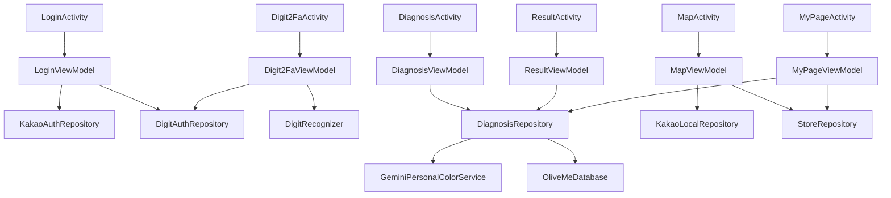

# OliveMe 단일 진실 명세서

버전: 2026-06-01
상태: 구현 기준 문서
적용 범위: `android/` Android 앱, GitHub 운영 하네스, 디자인 구현, 오류 방어, 발표/채점 증빙

## 1. 목표와 불변 규칙

OliveMe는 사용자가 얼굴 사진을 선택하거나 촬영하면 Gemini Vision으로 퍼스널 컬러를 분석하고, 어울리는 의류·메이크업 색상과 가까운 올리브영 매장을 추천하는 Android Kotlin 앱이다. 목표는 `Personalcolor design/`의 프로토타입과 최대한 동일한 화면·상호작용·톤을 Android 앱으로 구현하고, 발표 채점 기준의 기능 항목을 실제 코드와 시연 가능한 플로우로 증빙하는 것이다.

불변 규칙:

- 앱 이름은 `OliveMe`, Android `applicationId`는 `com.oliveme.app`이다.
- Android 프로젝트는 repo 루트가 아니라 `android/` 하위에 둔다.
- `docs/TRUTH_SPEC.md`가 단 하나의 진실 명세서다.
- `plan/`은 참고 자료로만 사용하고 git에 올리지 않는다.
- `Personalcolor design/`은 디자인 원본이므로 git에 추적한다.
- 구현은 `dev` 브랜치에 먼저 올리고 검수 후 PR로 `main`에 병합한다.
- 중대한 변경, 보안/설계 검토, 채점 리스크는 GitHub issue로 흔적을 남기고 PR에서 닫는다.
- 오류 발생으로 앱이 종료되면 안정성 0점 리스크가 있으므로 모든 외부 실패는 안내 메시지와 fallback 상태로 전환한다.

## 2. 입력 자료에서 확정된 요구사항

### 2.1 과제 및 채점 기준

`plan/personal_color_app_spec.md`, 11주차 Term Project 이미지, 강의실 사진에서 확인한 채점 요구사항:

| 항목 | 구현 증빙 | 목표 점수 |
| --- | --- | --- |
| Activity 3개 이상 + Intent | 7개 Activity, 2개 이상 Intent extra 전달 | 필수 |
| Coroutine | `viewModelScope`, `suspend`, `withContext(Dispatchers.IO)` | 20 |
| 다운로드/API 매니저 | Retrofit + Glide | 20 |
| Jetpack 3개 이상 | ViewPager2, Fragment, RecyclerView, DrawerLayout, Room, Compose | 30 |
| 외부 앱 연동 | 갤러리 선택, 카메라 촬영 Intent | 20 |
| API 3개 이상 | Gemini API, Kakao Login, Kakao Local/Map | 60 |
| DB | Room: 진단 이력, 추천 색상, 즐겨찾기 매장, 2FA 설정 | 30 |
| ML 모델 | 직접 학습한 MNIST TFLite digit model | 50 가능성 |
| 안정성 | 모든 오류 catch + fallback + 무중단 | 정성 0-10 |
| 완성도 | 버튼/스와이프/탭/저장/지도/마이페이지 동작 | 정성 0-10 |

DB와 API는 중복 계산하지 않는다. Room은 내부 DB이고, Gemini/Kakao는 외부 API이므로 별도 증빙으로 정리한다.

### 2.2 공식 문서 기반 API 기준

- Gemini Developer API는 `generateContent`를 사용한다.
- 모델 기본값은 `gemini-3.5-flash`이다.
- 이미지 입력은 작은 파일 기준 Base64 inline 방식이며, 큰 파일/재사용이 필요하면 File API로 확장한다.
- Gemini API key는 Google AI Studio/Google Cloud project에 속한다.
- Gemini 무료 티어는 무료 토큰을 제공하지만 사용자 입력이 제품 개선에 사용될 수 있으므로 앱 개인정보 안내에 반영한다.
- Kakao Login은 Android manifest에 Kakao auth scheme/activity가 필요하고, 사용자 정보 null 가능성을 방어한다.
- Kakao Local keyword search는 REST API key를 `Authorization: KakaoAK ...` 헤더로 보낸다.
- Kakao Map SDK는 키/해시 등록 실패 가능성을 UI fallback으로 처리한다.

## 3. Git, 브랜치, 하네스

### 3.1 브랜치 정책

- 로컬과 원격 브랜치는 `main`, `dev`만 허용한다.
- 구현자는 항상 `dev`에서 작업한다.
- `main` 병합은 GitHub PR만 허용한다.
- PR 제목은 기능 단위로 쓰고, 본문에 `Closes #issue-number`를 포함한다.
- 릴리스/최종 제출 전 `main` 기준으로 태그를 붙일 수 있지만 브랜치는 추가하지 않는다.

### 3.2 하네스 파일

- `AGENTS.md`: Codex/gstack 작업 규칙, browsing 규칙, branch 규칙, secret 규칙.
- `CLAUDE.md`: gstack skill routing, Android crash-free 규칙, single truth spec 규칙.
- `.github/ISSUE_TEMPLATE/*`: 구현, 보안, 디자인 리뷰 issue 템플릿.
- `.github/pull_request_template.md`: 채점 증빙, 테스트, secret 체크 항목.

### 3.3 제외 규칙

`.gitignore` 필수 제외:

- `plan/`
- `.gstack/`
- `android/.gradle/`
- `android/build/`
- `android/app/build/`
- `local.properties`, `android/local.properties`
- `.env`, `.env.*`
- `*.jks`, `*.keystore`, `*.p12`, `*.pem`
- IDE, build, ML cache: `.idea/`, `*.iml`, `tools/.venv/`, `tools/data/`, `tools/checkpoints/`

## 4. Android 아키텍처

### 4.1 프로젝트 구조

```text
android/
  settings.gradle.kts
  build.gradle.kts
  gradle.properties
  app/
    build.gradle.kts
    src/main/
      AndroidManifest.xml
      assets/digit_mnist.tflite
      java/com/oliveme/app/
        LoginActivity.kt
        Digit2FaActivity.kt
        MainActivity.kt
        DiagnosisActivity.kt
        ResultActivity.kt
        MapActivity.kt
        MyPageActivity.kt
        data/local/
        data/remote/
        data/repository/
        ml/
        ui/screens/
        ui/theme/
        util/
```

### 4.2 Activity와 Intent

| Activity | 역할 | 주요 Intent input | 주요 output |
| --- | --- | --- | --- |
| `LoginActivity` | Kakao login, demo login | 없음 | `userId`, `userName`, `email`, `profileImageUrl` |
| `Digit2FaActivity` | 선택형 손글씨 숫자 2FA | `userId`, `email`, `expectedDigit` | 2FA 통과 후 Main 이동 |
| `MainActivity` | 홈, drawer, quick action | user extras | Diagnosis/Map/MyPage 이동 |
| `DiagnosisActivity` | 카메라/갤러리, Gemini 진단 | user extras | `diagnosisId`, result extras |
| `ResultActivity` | 결과 ViewPager2, 저장, 공유 | `diagnosisId` or result extras | Map/MyPage 이동 |
| `MapActivity` | Kakao map/local, store favorite | location/user extras | favorite 저장 |
| `MyPageActivity` | 리포트, 이력, 저장 매장 | user extras | 재진단/결과 이동 |

공통 Intent key는 `IntentKeys` object에만 정의한다. Activity는 extra 누락 시 `DemoData.safeUser()`와 `DemoData.sampleResult()`로 복구한다.

### 4.3 ViewModel / Repository 관계



### 4.4 상태 모델

모든 ViewModel state는 `sealed interface` 또는 불변 `data class`로 둔다.

- `LoginUiState`: `Idle`, `Loading`, `NeedsDigit2Fa`, `LoggedIn`, `Error(message)`
- `Digit2FaUiState`: `Ready`, `Checking`, `Failed(message, attempts)`, `Passed`, `ModelUnavailable`
- `DiagnosisUiState`: `ChoosePhoto`, `Preview(uri)`, `Analyzing(step)`, `Success(result)`, `Fallback(result, reason)`, `Error(message)`
- `ResultUiState`: `Loading`, `Loaded(result, saved)`, `Fallback(result)`, `Error(message)`
- `MapUiState`: `Loading`, `Loaded(stores, selected)`, `Fallback(stores, reason)`
- `MyPageUiState`: `Loaded(profile, history, favorites)`, `Empty`, `Error(message)`

오류 state는 앱 종료가 아니라 화면에 안내를 보여주는 state다.

## 5. 디자인 구현 기준

### 5.1 디자인 원본 파일 역할

| 파일 | Android 반영 |
| --- | --- |
| `styles.css` | 색상, 그림자, radius, animation timing을 Compose theme로 변환 |
| `android-frame.jsx` | Android status/nav/app bar 느낌, phone frame 비율 참고 |
| `shared.jsx` | 공통 AppBar, Card, CTAButton, Swatch, Logo, FacePlaceholder |
| `src/app.jsx` | 화면 순서, swipe navigation, mock data, result data |
| `src/screens/login.jsx` | 로그인 hero, Kakao/email buttons, 약관 텍스트 |
| `src/screens/main.jsx` | drawer, greeting, hero CTA, quick actions, recent card |
| `src/screens/diagnosis.jsx` | choose/preview/analyzing stage, tips, scan animation |
| `src/screens/result.jsx` | ViewPager pages, palette, clothes, makeup, traits |
| `src/screens/map.jsx` | map overlay, search bar, chips, bottom sheet, store cards |
| `src/screens/mypage.jsx` | profile stats, report/history/stores tabs |
| `assets/*.png`, `uploads/*.png` | logo/mark resources |

`OliveMe.html`은 번들 데모 산출물이므로 원본 source보다 우선하지 않는다.

### 5.2 Theme tokens

Compose theme 값:

| CSS token | Hex | Compose name |
| --- | --- | --- |
| `--bg` | `#FBF6F2` | `OliveBg` |
| `--bg-soft` | `#F5EDE6` | `OliveBgSoft` |
| `--card` | `#FFFFFF` | `OliveCard` |
| `--card-2` | `#FFF9F5` | `OliveCardWarm` |
| `--primary` | `#F2A6B5` | `OlivePrimary` |
| `--primary-deep` | `#D87E92` | `OlivePrimaryDeep` |
| `--primary-soft` | `#FCE2E8` | `OlivePrimarySoft` |
| `--secondary` | `#C9B8E8` | `OliveSecondary` |
| `--secondary-soft` | `#ECE4F8` | `OliveSecondarySoft` |
| `--accent` | `#D4A574` | `OliveAccent` |
| `--accent-soft` | `#F4E6D2` | `OliveAccentSoft` |
| `--text` | `#3D3137` | `OliveText` |
| `--text-mid` | `#6B5A63` | `OliveTextMid` |
| `--text-dim` | `#A1909A` | `OliveTextDim` |
| `--line` | `#EDE3DC` | `OliveLine` |

Winter cool result palette:

`#722F37`, `#5B1A1F`, `#4A2347`, `#1B2A4E`, `#C13584`, `#B85C7B`, `#F2C2D1`, `#6B7280`, `#2F6E5F`.

### 5.3 화면별 상호작용

- Login: Kakao 버튼은 Kakao SDK 시도 후 실패 시 안내; 이메일 버튼은 demo login form을 표시한다.
- Demo login: `test01@gmail.com` / `test`만 성공. 성공 시 2FA 설정을 확인한다.
- Digit 2FA: 등록 숫자 `1`을 표시하고 손글씨 canvas에 사용자가 그린다. 맞으면 Main, 틀리면 무제한 재시도.
- Main: hamburger drawer, notification tap, diagnosis CTA, map/mypage quick action, recent result tap, bottom tabs.
- Diagnosis: camera/gallery 버튼, 선택 취소 처리, preview retry/analyze, analyzing 단계 animation, Gemini 실패 시 sample result.
- Result: ViewPager2 4페이지(type/clothes/makeup/traits), save toggle, share/download placeholder, map/mypage 이동, dot indicator.
- Map: 현재 위치 권한 허용 시 주변 검색, 거부/실패 시 부산대 좌표 fallback, chip 필터, marker/store card/favorite.
- MyPage: report/history/stores tabs, latest result open, favorite store open, redo diagnosis.

## 6. 데이터 설계

### 6.1 Entities

`UserProfileEntity`

- `userId: String` primary key
- `email: String`
- `displayName: String`
- `profileImageUrl: String?`
- `loginProvider: String` (`kakao`, `demo`)
- `createdAt: Long`
- `updatedAt: Long`

`DigitAuthConfigEntity`

- `userId: String` primary key
- `enabled: Boolean`
- `expectedDigit: Int`
- `threshold: Float` default `0.80f`
- `updatedAt: Long`

`DiagnosisHistoryEntity`

- `id: String` primary key
- `userId: String`
- `sourceImageUri: String?`
- `personalColorType: String`
- `englishLabel: String`
- `matchScore: Int`
- `description: String`
- `signature: String`
- `createdAt: Long`
- `isFallback: Boolean`

`RecommendedColorEntity`

- `id: String` primary key
- `diagnosisId: String`
- `hex: String`
- `name: String`
- `role: String` (`palette`, `avoid`, `cloth`, `makeup`)
- `sortOrder: Int`

`ProductRecommendationEntity`

- `id: String` primary key
- `diagnosisId: String`
- `category: String`
- `title: String`
- `subtitle: String`
- `colorHex: String`
- `sortOrder: Int`

`FavoriteStoreEntity`

- `id: String` primary key
- `userId: String`
- `name: String`
- `address: String`
- `distanceLabel: String`
- `lat: Double?`
- `lng: Double?`
- `phone: String?`
- `placeUrl: String?`
- `createdAt: Long`

### 6.2 DTOs

`PersonalColorResultDto`

- `type`, `englishLabel`, `matchScore`, `description`, `signature`
- `palette: List<ColorDto>`
- `avoidColors: List<ColorDto>`
- `clothes: List<ProductDto>`
- `makeup: Map<String, List<ProductDto>>`
- `traits: List<String>`
- `keywords: List<String>`

Gemini 응답은 strict JSON을 요청하지만, 파싱 실패 시 `DemoData.sampleResult(reason)`로 대체한다.

## 7. API와 민감정보

### 7.1 local.properties

구현자는 `android/local.properties` 또는 루트 `local.properties`에 다음 값을 둔다.

```properties
GEMINI_API_KEY=...
KAKAO_NATIVE_APP_KEY=...
KAKAO_REST_API_KEY=...
```

이 파일은 git에 올리지 않는다.

### 7.2 데모/프로덕션 보안

- 과제 데모에서는 Gradle `BuildConfig`로 key를 주입할 수 있다.
- 실제 배포에서는 Android 앱에 Gemini/Kakao REST key를 직접 넣지 않고 backend proxy를 둔다.
- 이 리스크는 security issue로 남기고, 현재 PR에서는 문서화와 템플릿으로 관리한다.
- 얼굴 사진은 진단 요청용 임시 데이터이며 Room에는 원본 byte를 저장하지 않는다.
- Gemini 무료 티어 사용 시 입력 데이터가 제품 개선에 사용될 수 있다는 안내를 약관/개인정보 문구에 둔다.

## 8. 2FA ML 명세

### 8.1 학습

- `tools/train_digit_model.py`는 TensorFlow/Keras로 MNIST 소형 CNN을 학습한다.
- 출력은 `android/app/src/main/assets/digit_mnist.tflite`.
- 모델 입력: `[1, 28, 28, 1]` float32, 0.0-1.0.
- 모델 출력: `[1, 10]` softmax.
- 학습 스크립트는 TensorFlow 미설치 시 명확한 설치 안내와 함께 종료한다.

### 8.2 런타임

- `DigitCanvas`는 stroke path를 bitmap으로 렌더링하고 28x28 grayscale로 변환한다.
- `DigitRecognizer.classify(bitmap)`는 Interpreter를 lazy load한다.
- 모델 파일 없음/손상/Interpreter 오류는 `DigitPrediction.unavailable`로 반환한다.
- `Digit2FaViewModel`은 expected digit과 threshold를 비교한다.
- 현재 정책은 무제한 재시도다. 나중에 제한하려면 `maxAttempts` 상수를 추가할 위치에 주석을 남긴다.

### 8.3 데모 계정

- email: `test01@gmail.com`
- password: `test`
- userId: `demo-test01`
- provider: `demo`
- 2FA enabled: true
- expectedDigit: `1`
- threshold: `0.80`

## 9. 오류 방지 표

| 위험 | 방어책 | fallback |
| --- | --- | --- |
| Kakao app 미설치/취소 | cancel은 오류로 보지 않고 login screen 유지 | demo login 사용 |
| Kakao user info null | nullable DTO, 기본 이름 `OliveMe User` | profile placeholder |
| key hash/API key 누락 | BuildConfig blank 체크 | mock user/API fallback |
| email/password 오류 | inline message | 재입력 |
| TFLite asset 누락/손상 | try-catch, unavailable state | 2FA 재시도/데모 안내 |
| 2FA 오인식 | 무제한 재시도, clear button | 앱 종료 없음 |
| 카메라 권한 거부 | permission result 처리 | gallery 선택 안내 |
| 갤러리 취소 | result null 처리 | choose photo 유지 |
| bitmap OOM | decode bounds, size 제한, compress | sample result |
| Gemini quota/network | timeout/retry 1회, IOException catch | sample winter cool result |
| Gemini JSON 파싱 실패 | lenient parse + schema validation | sample result |
| 위치 권한 거부 | 권한 상태 분기 | 부산대 좌표 |
| Kakao Local 실패 | HTTP error catch | sample 부산대 매장 5개 |
| Map SDK 실패 | map container fallback | mock map/cards |
| Room migration 오류 | destructive migration 금지, fallback read | in-memory sample |
| Intent extra 누락 | `IntentKeys` safe getters | sample user/result |
| 중복 클릭 | loading flag, debounce | 버튼 disabled |
| lifecycle 취소 | `viewModelScope`, idempotent state | previous stable state |

## 10. 테스트 기준

Unit tests:

- Gemini JSON success/failure parse.
- Kakao Local DTO parse.
- Room DAO insert/read.
- Demo login validation.
- Digit preprocessing and threshold comparison.
- fallback result generation.

Instrumented/manual tests:

- Kakao 취소 후 crash 없음.
- `test01@gmail.com` / `test` 로그인 성공.
- 2FA 숫자 1 성공, 잘못된 숫자 재시도.
- 카메라/갤러리 취소 후 choose screen 유지.
- Gemini key 없음 상태에서도 sample result 표시.
- Result ViewPager2 4페이지 이동.
- DrawerLayout 열고 닫기.
- RecyclerView 목록 스크롤.
- 위치 권한 거부 시 부산대 mock map.
- MyPage report/history/stores tab 이동.

최종 검수:

- `docs/TRUTH_SPEC.md`와 구현이 어긋나면 구현 또는 문서를 반드시 수정한다.
- PR 전 `gstack-review`와 가능한 범위의 Android build/test를 실행한다.
- UI는 `Personalcolor design/` reference와 스크린샷으로 비교한다.

## 11. 2인 작업 분배

팀원 A:

- Compose theme/component 구현.
- Login/Digit2Fa/Main/Result/MyPage UI.
- Activity/Intent 화면 연결.
- 디자인 스크린샷 대조.
- 발표 PPT 화면 설명.

팀원 B:

- Gemini/Kakao/Room/TFLite/Repository.
- camera/gallery/map/fallback.
- unit/instrumented tests.
- GitHub issue/PR 운영.
- 보안/오류 방지 표 검증.

공통:

- 진실 명세서 유지.
- 채점표 증빙 체크.
- 시연 리허설.
- PR 리뷰와 issue close 확인.

## 12. 자체 검토 결과

- 모든 화면의 주요 버튼과 이동 경로가 명시되었다.
- 모든 민감정보 보관 위치와 제외 규칙이 명시되었다.
- API/DB/ML/Jetpack/외부 앱 연동의 채점 근거가 분리되었다.
- 예상 실패 모드와 fallback이 표로 정리되었다.
- 디자인 원본의 source 파일별 반영 방식이 정리되었다.
- 2인 작업 분배가 UI/플랫폼 축으로 공평하게 나뉘었다.

남은 의도적 제한:

- backend proxy는 현재 과제 데모 범위 밖이다. 단, 보안 issue와 명세서로 반드시 흔적을 남긴다.
- TFLite 모델 파일은 `tools/train_digit_model.py`로 재생성 가능해야 하며, 런타임은 모델 손상에도 crash-free여야 한다.
