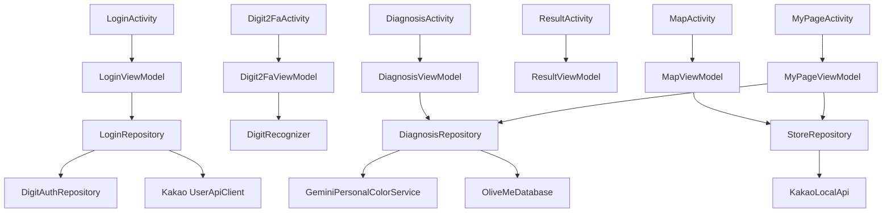

# OliveMe 단일 진실 명세서

버전: 2026-06-02
상태: 현재 구현 사실 + HTML 1:1 목표 기준 문서
적용 범위: `android/` Android 앱, GitHub 운영 하네스, 디자인 구현, 오류 방어, 발표/채점 증빙

## 0. 퍼스널 컬러 진단법 기준

퍼스널 컬러 진단 기준은 `docs/PERSONAL_COLOR_DIAGNOSIS_METHOD.md`를 우선한다. Gemini 프롬프트, 12타입 fallback, 결과 화면 이미지, 추천 팔레트, 의상·메이크업·특징 템플릿은 이 문서와 `android/app/src/main/assets/seed/diagnosis_policy.json` 기준으로 구현한다.

현재 정책은 12타입을 사용한다: `spring-light`, `spring-bright`, `spring-warm`, `summer-light`, `summer-soft`, `summer-cool`, `autumn-soft`, `autumn-warm`, `autumn-deep`, `winter-bright`, `winter-cool`, `winter-deep`.

퍼스널 컬러는 스타일 추천이며 의료·신원·민감 속성 판단이 아니다. 앱은 얼굴 원본 이미지를 저장하지 않고, 압축 이미지와 진단 결과만 임시 처리한다.

## 1. 목표와 불변 규칙

OliveMe는 사용자가 얼굴 사진을 선택하거나 촬영하면 Gemini Vision 기준의 퍼스널 컬러 분석을 수행하고, 어울리는 의류·메이크업 색상과 가까운 뷰티 매장을 추천하는 Android Kotlin 앱이다. 최종 목표는 `Personalcolor design/`의 HTML/JSX/CSS 프로토타입과 화면 구조, 버튼 흐름, 상호작용 톤을 최대한 1:1로 맞추는 것이다.

이 문서는 두 기준을 분리한다.

- **현재 구현 사실**: 지금 Android 코드가 실제로 수행하는 동작이다. 완료 기능처럼 말할 수 있는 것은 이 항목뿐이다.
- **HTML 1:1 목표**: `Personalcolor design/`에 이미 존재하지만 Android 구현이 아직 따라가야 하는 동작이다. PR과 issue로 추적한다.

불변 규칙:

- 앱 이름은 `OliveMe`, Android `applicationId`는 `com.oliveme.app`이다.
- Android 프로젝트는 repo 루트가 아니라 `android/` 하위에 둔다.
- `docs/TRUTH_SPEC.md`가 단 하나의 진실 명세서다.
- 모든 에이전트는 `AGENTS.md`를 기본 하네스로 읽고, 이 문서를 최우선 기준으로 삼는다.
- `CLAUDE.md`는 Claude 호환용 보조 문서이며 기본 운영 기준이 아니다.
- `plan/`은 참고 자료로만 사용하고 git에 올리지 않는다.
- `Personalcolor design/`은 디자인 원본이므로 git에는 추적하되 Android 구현 중 수정하지 않는다.
- 구현은 `dev` 브랜치에 먼저 올리고 검수 후 PR로 `main`에 병합한다.
- 중대한 변경, 보안/설계 검토, 채점 리스크, HTML parity 미달 항목은 GitHub issue로 흔적을 남기고 PR에서 닫는다.
- 오류 발생으로 앱이 종료되면 안정성 0점 리스크가 있으므로 모든 외부 실패는 안내 메시지와 fallback 상태로 전환한다.

### 1.1 UI 감축 및 접근성 원칙

2026-06-01 이후 UI 정리 작업의 기준은 "기능 삭제 없이 노출 밀도만 낮추기"다. 사용자가 보는 버튼 수는 줄이되, 기존 기능은 반드시 `bottom sheet`, `overflow`, `selected card`, `settings`, `toast action`, 명확한 화면 이동 중 하나로 접근 가능해야 한다.

- 화면당 primary CTA는 1개를 기본값으로 한다.
- 보조 CTA는 최대 1개만 상시 노출한다.
- 세 번째 이후 기능은 sheet, overflow, 선택된 카드, 설정 화면으로 접는다.
- 숨긴 기능은 버튼 매트릭스에 새 접근 경로를 기록한다.
- `준비 중입니다`만 표시하는 버튼은 사용자 화면에서 숨기거나 설정/정보 항목으로 이동한다.
- 사용자는 주요 기능에 최대 2-3번 탭 안에 도달해야 한다.
- 모든 icon button은 `contentDescription`과 실제 이벤트를 가진다.

사용자 화면 금지 문구:

- 외부 AI/API 실패를 그대로 드러내는 내부 구현어
- sample 또는 fallback 같은 개발자용 상태명
- `샘플 리포트`
- `모델 준비 전 통과`
- `S1`, `S2`, `S3`, `S4`
- 근거 없는 고정 시간 문구인 `18초`
- 근거 없는 고정 성능 문구인 `정확도 92%`

허용 대체 문구:

- `최근 리포트`
- `샘플로 체험`
- `컬러를 정리하고 있어요`
- `부산대 기준 추천 매장`
- `컬러 가이드`

## 2. 입력 자료에서 확정된 요구사항

### 2.1 과제 및 채점 기준

`plan/` 자료와 강의/채점 기준에서 확인한 증빙 요구사항:

| 항목 | 현재 구현/증빙 기준 |
| --- | --- |
| Activity 3개 이상 + Intent | `LoginActivity`, `Digit2FaActivity`, `MainActivity`, `DiagnosisActivity`, `ResultActivity`, `MapActivity`, `MyPageActivity`; `IntentKeys`로 user/result extra 전달 |
| Coroutine | `viewModelScope`, `suspend`, `withContext(Dispatchers.IO)` |
| 다운로드/API 매니저 | Retrofit API service, Glide dependency |
| Jetpack 3개 이상 | Room, Compose, ViewModel, plus `LegacyJetpackEvidence`로 ViewPager2/Fragment/RecyclerView/DrawerLayout 증빙 |
| 외부 앱 연동 | 갤러리 선택, 카메라 preview, share Intent 목표 |
| API 3개 이상 | Gemini, Kakao Login, Kakao Local REST, OSM tile/WebView 지도, Google Maps 외부 Intent |
| DB | Room: user, digit auth, diagnosis history, colors, products, favorite stores |
| ML 모델 | 직접 학습한 MNIST TFLite digit model asset |
| 안정성 | 모든 취소/권한/API/model 실패를 crash-free fallback으로 처리 |
| 완성도 | HTML 기준 버튼/탭/지도/마이페이지/저장/공유 동작을 구현 목표로 추적 |

중요: `LegacyJetpackEvidence`는 채점 증빙용 숨은/보조 Android View 계층이다. 현재 사용자 화면의 결과 탭은 user-visible `ViewPager2`가 아니라 Compose tab state로 동작한다.

### 2.2 공식 문서 기반 API 기준

- Gemini Developer API는 `generateContent`를 사용한다.
- 모델 기본값은 빠른 응답과 최근 QA 안정성을 우선해 `gemini-2.5-flash`이다. 샘플 파일명 계절은 QA 입력 라벨이고, 결과 계절은 Gemini 판단과 이미지 품질에 따라 달라질 수 있다.
- 모델 fallback chain은 `gemini-2.5-flash -> gemini-2.0-flash -> gemini-flash-latest`이다. 3.5 계열은 고수요/지연 변동이 커 기본 앱 흐름에서는 사용하지 않는다.
- 이미지 입력은 Base64 inline 방식이다.
- Gemini API key는 Google AI Studio/Google Cloud project에 속한다.
- Gemini 무료 티어는 입력 데이터가 제품 개선에 사용될 수 있으므로 개인정보 안내에 반영한다.
- Kakao Login은 Android manifest auth scheme/activity와 nullable user info 방어가 필요하다.
- Kakao Local keyword search는 REST API key를 `Authorization: KakaoAK ...` 헤더로 보낸다.
- 지도 surface는 모든 ABI/기기 호환성을 위해 앱 내 WebView + 로컬 Leaflet asset + OpenStreetMap HTTPS tile로 통일한다. Kakao Maps Android native SDK는 사용하지 않는다.
- 매장 검색 데이터는 Kakao Local REST keyword search를 사용하고, 마커/매장 카드의 길찾기 또는 상세 이동은 Google Maps 앱을 우선 실행한다. Google Maps 앱이 없으면 동일 Google Maps URL을 일반 브라우저/기본 지도 앱으로 연다.
- 지도 현재 위치는 Fused fresh location을 먼저 요청하고, 실패 시 Android `LocationManager` 단발 fresh 요청, 유효한 국내 좌표 last-known, 부산대 기준 fallback 순으로 처리한다. 오래된 국외 last-known 좌표는 국내 매장 검색에 사용하지 않는다.

## 3. Git, 브랜치, 하네스

### 3.1 브랜치 정책

- 로컬과 원격 브랜치는 `main`, `dev`만 허용한다.
- 구현자는 항상 `dev`에서 작업한다.
- `main` 병합은 GitHub PR만 허용한다.
- PR 제목은 기능 단위로 쓰고, 본문에 `Closes #issue-number`를 포함한다.

### 3.2 하네스 파일

- `AGENTS.md`: 기본 공용 하네스. `docs/TRUTH_SPEC.md` 최우선, Android QA는 `@test-android-apps`, HTML 확인은 `gstack-browse`, `Personalcolor design/` 수정 금지를 명시한다.
- `CLAUDE.md`: Claude 호환 보조 문서. 기본 운영 기준은 `AGENTS.md`와 `docs/TRUTH_SPEC.md`임을 명시한다.
- `.github/ISSUE_TEMPLATE/*`: 구현, 보안, 디자인 리뷰 issue 템플릿.
- `.github/pull_request_template.md`: 채점 증빙, Test Android Apps artifact, HTML 대조, secret 체크 항목.

### 3.3 제외 규칙

`.gitignore` 필수 제외:

- `plan/`
- `.gstack/`
- `android/.gradle/`
- `android/build/`
- `android/app/build/`
- `local.properties`, `android/local.properties`
- `.env`, `.env.*`
- `*.jks`, `*.keystore`, `*.p12`, `*.pem`
- `.idea/`, `*.iml/`, `tools/.venv/`, `tools/data/`, `tools/checkpoints/`

## 4. Android 아키텍처

### 4.1 프로젝트 구조

```text
android/
  settings.gradle.kts
  build.gradle.kts
  gradle.properties
  app/
    build.gradle.kts
    src/main/
      AndroidManifest.xml
      assets/digit_mnist.tflite
      java/com/oliveme/app/
        LoginActivity.kt
        Digit2FaActivity.kt
        MainActivity.kt
        DiagnosisActivity.kt
        ResultActivity.kt
        MapActivity.kt
        MyPageActivity.kt
        data/local/
        data/remote/
        data/repository/
        ml/
        ui/screens/
        ui/theme/
        util/
```

### 4.2 Activity와 Intent

| Activity | 현재 역할 | 주요 Intent input | 실패/누락 fallback |
| --- | --- | --- | --- |
| `LoginActivity` | Kakao login, email login, local signup, 바로 시작 | 없음 | login error text |
| `Digit2FaActivity` | 계정 손글씨 숫자 2FA | `userId`, `email`, `expectedDigit` | 실패 메시지 + 무제한 재시도 |
| `MainActivity` | 홈, drawer, quick action | user extras | `DemoData.safeUser()` |
| `DiagnosisActivity` | 카메라/갤러리, Gemini/policy 진단, 결과 자동 이동 | user extras | policy result |
| `ResultActivity` | 결과 탭, 저장, 이동 | user extras/result 목표 | policy result |
| `MapActivity` | Kakao Local/store seed | user/location 목표 | 부산대 seed stores |
| `MyPageActivity` | 리포트, 이력, 즐겨찾기 | user extras | safe profile/policy result |

공통 Intent key는 `IntentKeys` object에 정의한다. Activity는 extra 누락 시 safe user/result로 복구한다.

### 4.3 ViewModel / Repository 관계



### 4.4 현재 상태 모델

현재 Kotlin 구현과 일치하는 state만 완료 기능으로 말한다.

- `LoginUiState`: `Idle`, `Loading`, `NeedsDigit2Fa(user, expectedDigit)`, `LoggedIn(user)`, `Error(message)`
- `Digit2FaUiState`: `Ready`, `Checking`, `Failed(message, attempts)`, `Passed(prediction, confidence)`
- `DiagnosisUiState`: `ChoosePhoto(notice?)`, `Preview(uri)`, `Analyzing(step)`, `Success(result)`, `Fallback(result, reason)`
- `ResultUiState`: `data class ResultUiState(result, saved)`
- `MapUiState`: `data class MapUiState(stores, selected, fallbackReason, activeFilter, favoriteIds)`
- `MyPageUiState`: `data class MyPageUiState(history, favorites)`

현재 없는 state:

- `Digit2FaUiState.ModelUnavailable`
- `DiagnosisUiState.Error`
- `ResultUiState.Loading/Loaded/Fallback/Error`
- `MapUiState.Loading/Loaded/Fallback`
- `MyPageUiState.Loaded/Empty/Error`

이 state들은 구현 전까지 명세서에서 완료 기능처럼 쓰지 않는다.

## 5. 디자인 구현 기준

### 5.1 디자인 원본 파일 역할

| 파일 | Android 반영 기준 |
| --- | --- |
| `styles.css` | 색상, radius, shadow, animation timing을 Compose theme/common component로 변환 |
| `android-frame.jsx` | Android frame, status/nav bar, phone 비율 참고 |
| `shared.jsx` | AppBar, Card, CTAButton, Swatch, Logo, Avatar, Placeholder |
| `src/app.jsx` | 화면 순서, mock data, navigation intent |
| `src/screens/login.jsx` | login hero, Kakao/email buttons, terms text |
| `src/screens/main.jsx` | drawer, greeting, hero CTA, quick action, recent card |
| `src/screens/diagnosis.jsx` | choose/preview/analyzing/sample photo row |
| `src/screens/result.jsx` | 4 tabs, dot indicator, save toast, share, bottom actions |
| `src/screens/map.jsx` | full-bleed 지도형 배경, search bar, filter chips, markers, bottom sheet |
| `src/screens/mypage.jsx` | profile header, stats row, magazine report, history/stores tabs |
| `assets/*.png`, `uploads/*.png` | logo/mark/image resources |

`OliveMe.html`은 보조 번들 산출물이다. 원본 우선순위는 `src/*.jsx`와 `styles.css`다.

### 5.2 Theme tokens

| CSS token | Hex | Compose name |
| --- | --- | --- |
| `--bg` | `#FBF6F2` | `OliveBg` |
| `--bg-soft` | `#F5EDE6` | `OliveBgSoft` |
| `--card` | `#FFFFFF` | `OliveCard` |
| `--card-2` | `#FFF9F5` | `OliveCardWarm` |
| `--primary` | `#F2A6B5` | `OlivePrimary` |
| `--primary-deep` | `#D87E92` | `OlivePrimaryDeep` |
| `--primary-soft` | `#FCE2E8` | `OlivePrimarySoft` |
| `--secondary` | `#C9B8E8` | `OliveSecondary` |
| `--secondary-soft` | `#ECE4F8` | `OliveSecondarySoft` |
| `--accent` | `#D4A574` | `OliveAccent` |
| `--accent-soft` | `#F4E6D2` | `OliveAccentSoft` |
| `--text` | `#3D3137` | `OliveText` |
| `--text-mid` | `#6B5A63` | `OliveTextMid` |
| `--text-dim` | `#A1909A` | `OliveTextDim` |
| `--line` | `#EDE3DC` | `OliveLine` |

### 5.3 화면별 현재 구현과 HTML 목표

### 5.4 UI 감축 후 버튼 매트릭스

| 화면 | 기능 | 새 접근 경로 | 실제 이벤트 | 실패 fallback | QA 확인 방법 |
| --- | --- | --- | --- | --- | --- |
| Login | Kakao login | 첫 화면 `카카오로 시작하기` -> 통합 이용 동의 | Kakao SDK login + account consent version 저장 | error text | Kakao 취소/실패 후 앱 유지 |
| Login | 이메일 로그인 | 첫 화면 `이메일로 로그인하기` -> bottom sheet | email/password 검증 | sheet inline error | invalid login 후 재시도 |
| Login | 회원가입 | email bottom sheet `회원가입` -> 통합 이용 동의 | local Room account 생성 + account consent version 저장 | inline error | invalid/valid signup |
| Login | 바로 시작 | email bottom sheet `바로 시작` -> 통합 이용 동의 | `게스트` 계정 표시 + guest consent version 저장 후 2FA/Main 이동 | login error text | 동의 후 2FA 이동, 재실행 시 같은 version 동의 미노출 |
| Digit2Fa | 인증 | canvas + 인증 버튼 | TFLite classify | 실패 메시지 + 무제한 재시도 | 빈 캔버스/오답/정답 |
| Main | drawer | 상단 menu icon | drawer open/close | Back closes drawer | drawer 6개 항목 확인 |
| Main | 진단 | drawer `진단`, hero CTA | `DiagnosisActivity` | safe user extra | 진단 화면 이동 |
| Main | 결과 | drawer `결과`, 최근 결과 card | `ResultActivity` | policy result | 결과 화면 이동 |
| Main | 매장 | drawer `매장`, quick action | `MapActivity` | seed stores | 지도 화면 이동 |
| Main | 설정 | drawer `설정` | `SettingsActivity` | safe user extra | 설정 화면 이동 |
| Main | 로그아웃 | drawer `로그아웃` | `LoginActivity`로 이동 후 finish | Login 재표시 | 재로그인 가능 |
| Diagnosis | 사진 선택 | 큰 업로드 card | action bottom sheet open | sheet 유지 | sheet 항목 확인 |
| Diagnosis | camera | upload sheet `카메라` | camera preview | 권한/취소 안내 | 권한 거부/취소 |
| Diagnosis | gallery | upload sheet `갤러리` | image picker | 취소 안내 | picker 취소 |
| Diagnosis | sample | upload sheet `샘플로 체험` | sample preview | policy result | sample preview |
| Diagnosis | analyze | preview `분석 시작` | Gemini or policy result save 후 `ResultActivity` 자동 이동 | Result 내부 `컬러 가이드` 안내 | 중간 완료 페이지 없이 결과 화면 |
| Result | save | top heart icon | saved state toggle | toast | 저장 icon 변화 |
| Result | share | top overflow menu | `ACTION_SEND` chooser | 앱 없음 toast | chooser/fallback |
| Result | commerce disclosure | 의상/메이크업 추천 tab 상단 `제휴 추천` chip | 추천 기준 안내 toggle | chip 유지, 상품 카드 반복 문구 금지 | chip tap 후 설명 open/close |
| Result | map | 추천 섹션 card | `MapActivity` | seed stores | 지도 이동 |
| Result | mypage save | bottom primary | `MyPageActivity` | safe user extra | 마이페이지 이동 |
| Map | locate | top location icon | stores reload | 부산대 기준 안내 | fallback 안내 |
| Map | filter | `전체`, `영업 중`, `저장` chips | in-memory filter | empty state | chip별 목록 |
| Map | favorite | selected store card icon | Room favorite toggle | toast 유지 | 저장 chip 반영 |
| Map | marker details | OSM marker label tap | Google Maps search URL 외부 Intent | 일반 browser/default map fallback | marker tap 후 외부 지도 열림 |
| Map | directions | selected store card icon | Google Maps search URL 외부 Intent | 앱 없음 toast | no crash |
| MyPage | settings | top settings icon | `SettingsActivity` | safe user extra | 설정 이동 |
| MyPage | tabs | `리포트`, `이력`, `매장` | tab state change | empty state | 세 탭 확인 |
| MyPage | report share/save | overflow menu | share/save toast | 앱 없음 toast | overflow 확인 |
| MyPage | history item | 이력 tab card | `ResultActivity` | policy result | 결과 이동 |
| MyPage | history delete | 이력 item overflow `삭제` | 관련 colors/products/history transaction 삭제 | 확인 dialog 취소/삭제 | 삭제 후 이력 갱신 |
| MyPage | store item | 매장 tab card | `MapActivity` | seed stores | 지도 이동 |
| MyPage | redo | report primary | `DiagnosisActivity` | safe user extra | 진단 이동 |
| Settings | 2FA test | 보안 section | `Digit2FaActivity` | model unavailable retry | 2FA 화면 이동 |
| Settings | delete history | 진단 기록 section | user history delete | confirmation toast | MyPage 이력 갱신 |
| Settings | clear favorites | 위치/매장 section | user favorites delete | confirmation toast | Map 저장 필터 |
| Settings | logout | 계정 section | `LoginActivity`로 이동 후 finish | Login 재표시 | 재로그인 가능 |

| 화면 | 현재 구현 사실 | HTML 1:1 목표 |
| --- | --- | --- |
| Login | full logo, Kakao, `이메일로 로그인하기`, email/password sheet, local signup, 바로 시작, full-screen 통합 이용 동의 | translucent bottom sheet spacing 추가 정밀화 |
| Digit 2FA | 손글씨 canvas, TFLite 판정, model-unavailable continue button, reset | 숫자 1 인증 안정성, 빈/작은 stroke 안내, 크래시 금지 |
| Main | 6-item drawer, hero CTA, quick action, recent -> result, color story pills | bottom tab 또는 동일 navigation density 정밀화 |
| Diagnosis | upload card, action sheet camera/gallery/sample, cancel notice, help toast, preview, analyze, mechanical/policy fallback | 4/5 upload/preview area와 scan animation 정밀화 |
| Result | Compose 4 tabs, dot indicator, save icon, overflow share, map recommendation card, mypage primary | user-visible swipe pager 정밀화 |
| Map | WebView + 로컬 Leaflet + OpenStreetMap tile interactive map, search bar, 3 filters, markers, bottom sheet, selected-card favorite/directions. Marker tap은 내부 선택이 아니라 Google Maps 외부 이동이다. | 모든 기기/ABI에서 pan/zoom 가능한 실제 tile map 유지, 길찾기는 Google Maps 외부 Intent |
| MyPage | avatar, stats row, short tabs, magazine report, overflow save/share, clickable history/store, empty state, redo | HTML spacing/thumbnail fidelity 정밀화 |

## 6. 데이터 설계

### 6.1 Entities

- `UserProfileEntity(userId, email, displayName, profileImageUrl, loginProvider, createdAt, updatedAt)`
- `AuthCredentialEntity(email, userId, passwordHash, passwordSalt, createdAt, updatedAt)`
- `DigitAuthConfigEntity(userId, enabled, expectedDigit, threshold, updatedAt)`
- `LegalConsentEntity(userId, policyVersion, privacyVersion, commerceVersion, agreedAt, source)`
- `DiagnosisHistoryEntity(id, userId, sourceImageUri, personalColorType, englishLabel, season, subtype, temperature, value, chroma, contrast, confidence, qualityLabel, heroAsset, sourceEvidence, matchScore, description, signature, createdAt, isFallback)`
- `RecommendedColorEntity(id, diagnosisId, hex, name, role, sortOrder)`
- `ProductRecommendationEntity(id, diagnosisId, category, title, subtitle, colorHex, sortOrder)`
- `FavoriteStoreEntity(id, userId, name, address, distanceLabel, lat, lng, phone, placeUrl, createdAt)`
- `ColorStoryEntity(id, title, subtitle, tag, body, personalColorType, sortOrder, updatedAt)`

Room version은 `4`다. v1에서 v2로 갈 때 `auth_credentials`, `color_stories` 테이블을 추가하고, v2에서 v3로 갈 때 12타입 진단 필드와 결과 이미지 필드를 추가한다. v3에서 v4로 갈 때 `legal_consents` 테이블을 추가한다.

### 6.2 DTOs

- `GeminiGenerateContentRequest/Response`: Gemini `generateContent` request/response.
- `KakaoKeywordSearchResponse`: Kakao Local keyword search response.
- `PersonalColorResult`: 12타입 app domain result. `season`, `subtype`, `temperature`, `value`, `chroma`, `contrast`, `confidence`, `qualityLabel`, `qualityWarnings`, `sourceEvidence`, `heroAsset`, `productKeywords`를 가진다.

Gemini 응답은 JSON only prompt를 요청하고, 현재 구현은 Markdown fence를 제거한 뒤 `JsonElement` 기반 tolerant parser로 v2 스키마를 파싱한다. `confidence: "High"`, `matchScore: 0.95`, 객체형 `signature`처럼 실제 Gemini 응답 타입이 흔들려도 canonical domain 값으로 정규화한다. 파싱 실패나 upstream 고수요 실패 시 `assets/seed/diagnosis_policy.json` 기반 결과로 전환한다.

### 6.3 로컬 회원가입, 게스트 시작, 법적 동의

현재 구현 기준:

- 이메일 로그인은 `LoginRepository.loginEmail`을 통한다.
- 로그인 실패 문구는 이메일 미존재/비밀번호 불일치/seed 계정 오류 모두 `해당되는 정보가 없습니다.`로 통일한다.
- 회원가입은 과제 데모용 로컬 Room 계정이다.
- 회원가입 필드: 이메일, 비밀번호, 비밀번호 확인, 닉네임.
- 회원가입, 카카오 시작, 바로 시작은 모두 full-screen `통합 이용 동의`를 먼저 통과해야 한다.
- 통합 동의는 긴 스크롤 문서와 5개 분리 체크 항목으로 구성한다: 서비스 이용약관, 개인정보 수집·이용, 위치/사진 처리, AI 분석 및 외부 API, 상품 추천 및 제휴성 추천 정보.
- 사용자는 문서 끝까지 스크롤하고 모든 항목을 체크해야 `동의하고 계속` 버튼을 누를 수 있다.
- 계정 사용자의 동의는 `LegalConsentEntity`에 version/timestamp/source만 저장한다. 동의 원문, 개인정보, key는 log에 남기지 않는다.
- 계정 없이 `바로 시작`한 사용자는 `SharedPreferences`에 guest consent version/timestamp를 저장한다. 앱 삭제 전까지 같은 version에서는 다시 보여주지 않는다.
- 정책/개인정보/커머스 version이 바뀌면 재동의를 받는다.
- 검증: 이메일 형식, 비밀번호 8자 이상, 비밀번호 확인 일치, 닉네임 2-12자, 동의 필수.
- 로컬 비밀번호는 평문 저장 금지. 현재는 `salt + SHA-256` 해시로 저장한다.
- 새 이메일 계정은 2FA 기본 OFF다.
- 테스트 seed 계정 `test01@gmail.com` / `test`는 2FA 숫자 `1`을 유지한다.
- `바로 시작` 또는 seed 계정 표시 이름은 항상 `게스트`다. 랜덤 닉네임은 생성하지 않는다.
- seed 계정 로그인 시 `DemoSeedRepository.ensureDemoData`가 이력/즐겨찾기/컬러 스토리를 한 번 seed한다. 사용자 화면에는 `데모 계정` 표현을 노출하지 않는다.

프로덕션 기준:

- 로컬 password hash는 과제 데모용이다.
- 실제 서비스는 Firebase Auth 또는 자체 backend auth, 이메일 인증, 비밀번호 재설정, rate limit, abuse protection이 필요하다.
- 로그인 오류는 OWASP Authentication Cheat Sheet 기준처럼 계정 존재 여부를 드러내지 않는 generic message를 유지한다.

### 6.4 Hardcoded 데이터 전수 목록과 준비 방식

| 데이터 종류 | 기존 위치/문제 | 현재/목표 구현 방식 |
| --- | --- | --- |
| seed 사용자 | `UiText`, `DemoData.demoUser` | 고정 seed credential + 표시 이름 `게스트`, 사용자 화면에서 `데모 계정` 표현 금지 |
| 회원가입 계정 | 없음 | `AuthCredentialEntity` + `UserProfileEntity`, 프로덕션은 Firebase/backend |
| 진단 결과 | `DemoData.sampleResult` 직접 호출 | Gemini 결과를 Room 저장, 실패/샘플/초기 state는 `assets/seed/diagnosis_policy.json`의 12타입 템플릿으로 전환 |
| 톤별 샘플 | `쿨/웜/딥/라이트` label | 12타입 정책 + `spring-warm`, `summer-cool`, `autumn-warm`, `winter-cool` 대표 sample URI/result |
| 샘플 이미지 | 없음 | `assets/sample_faces/*.png` 실사형 테스트 portrait 4장, subtype 부족분은 계절 대표 asset으로 mapping |
| 홈 최근 결과 | `MainScreen` 직접 sample | `MainViewModel`이 Room 최신 이력에서 로드 |
| 홈 quick count | `2.4km`, `진단 이력 3건` | 저장된 이력/즐겨찾기 수 또는 fallback region label |
| 오늘의 컬러 스토리 | 화면 hardcoded pill | `ColorStoryEntity`, `assets/seed/color_stories.json`, `SeedContentRepository` |
| 제품 추천 | `DemoData` result 내부 | `ProductRecommendationEntity`, `assets/seed/product_catalog.json`, Result의 optional backend proxy Naver Shopping + Gemini commerce summary endpoint, 실패 시 섹션 미노출 |
| 지도 매장 | Kakao 실패 시 sample | Kakao Local 성공값 우선, 실패 시 `assets/seed/stores.json`의 부산대 seed stores |
| 즐겨찾기 | 과거 sample store 의존 | Room `FavoriteStoreEntity`, demo seed 2건 |
| 마이페이지 리포트 | 화면에서 새 sample 생성 | `MyPageUiState.latestResult`가 Repository 결과 사용 |
| 진단 이력 삭제 | 설정의 전체 삭제만 있음 | MyPage 이력 항목별 삭제 + 확인 dialog, 설정 전체 삭제 병행 |
| 설정/법적 고지 | 화면 text | `LegalConsentEntity` + guest SharedPreferences + `TRUTH_SPEC` version 기준. 설정은 요약 안내, 최초 진입은 full-screen 동의 |
| 알림 | 실제 FCM 없음 | backend proxy FCM test endpoint 준비, Android FCM은 프로젝트 준비 후 연결 |

### 6.5 Gemini 진단 응답 스키마

Gemini 입력은 `generateContent` + Base64 inline image다. 공식 문서 기준 inline payload는 작은 파일에 사용하고 전체 request는 20MB 미만으로 유지한다. 현재 앱은 `ImageBytesLoader`로 압축한 JPEG를 보낸다.

요청 prompt는 다음 정책을 따른다.

- 한국어 퍼스널 컬러 스타일링 컨설턴트 역할만 수행한다.
- 신원, 민족, 건강, 질병, 나이 등 민감한 속성은 추정하지 않는다.
- 조명/필터/흔들림이 부적합해도 앱이 필요한 JSON skeleton은 반환한다.
- markdown fence 없이 JSON만 반환한다.

필수 응답 field:

```json
{
  "schemaVersion": "oliveme.personal_color.v1",
  "type": "겨울 쿨톤",
  "englishLabel": "WINTER · COOL · DEEP",
  "season": "winter",
  "tone": "cool",
  "undertone": "cool",
  "depth": "deep",
  "chroma": "clear",
  "matchScore": 92,
  "confidenceScore": 84,
  "imageQuality": {
    "lighting": "good",
    "faceVisible": true,
    "blur": "low",
    "makeupOrFilterWarning": "none",
    "retryRecommended": false
  },
  "description": "...",
  "signature": "...",
  "palette": [{"hex": "#722F37", "name": "와인", "role": "best", "reason": "..."}],
  "avoidColors": [{"hex": "#D9A05B", "name": "머스터드", "role": "avoid", "reason": "..."}],
  "clothes": [{"category": "top", "title": "플럼 니트", "subtitle": "...", "colorHex": "#4A2347", "reason": "..."}],
  "makeup": {
    "lip": [{"category": "lip", "title": "...", "subtitle": "...", "colorHex": "#B85C7B", "reason": "..."}],
    "eye": [],
    "base": [],
    "cheek": []
  },
  "traits": ["..."],
  "keywords": ["Cool"],
  "storeSearchKeywords": ["올리브영 쿨톤 립"],
  "contentStoryTags": ["winter", "cool"],
  "disclaimer": "사진 조명과 필터에 따라 결과가 달라질 수 있습니다."
}
```

현재 domain model은 일부 확장 field를 표시하지 않는다. 표시하지 않는 field도 prompt에는 유지해 backend/API 실험에서 필요한 데이터를 검증한다.

색 추천 출처는 다음처럼 구분한다.

- Gemini 진단 성공: `GeminiPersonalColorService`가 `palette`, `avoidColors`, `outfit`, `makeup`, `features`를 JSON으로 받아 Room에 저장한다.
- Gemini 실패, API key 없음, 120초 timeout, JSON parse 실패: `DiagnosisPolicyRepository`가 `assets/seed/diagnosis_policy.json`의 12타입 정책과 `PhotoQuality`/이미지 특징 기반 fallback을 사용한다.
- 화면 표시는 항상 Room에 저장된 진단 결과를 우선한다. Room 결과가 없으면 초기/빈 상태용 policy sample만 사용한다.
- Result의 커머스 AI 추천은 색을 새로 판정하지 않는다. 이미 저장된 `palette`/`avoidColors`와 타입, Naver 상품 목록을 backend Gemini 요약에 보내 상품 추천 문구와 `picks`를 생성한다. `picks`는 Naver 상품 목록의 rank 중 2-3개를 골라 이유와 함께 내려주며, Android는 `AI 추천` 카드 안에 `AI가 고른 상품` 썸네일 행으로 표시한다. Gemini commerce 요약이 실패하면 backend가 같은 상품/팔레트 입력으로 로컬 추천 요약과 rank 기반 picks를 만들어 `AI 추천` 위치를 비워두지 않는다.

## 7. API와 민감정보

### 7.1 local.properties

Android 직접 API 경로에 필요한 값은 `android/local.properties` 또는 루트 `local.properties`에 둔다.

```properties
GEMINI_API_KEY=...
KAKAO_NATIVE_APP_KEY=...
KAKAO_REST_API_KEY=...
BACKEND_BASE_URL=http://127.0.0.1:8787/
```

이 파일은 git에 올리지 않는다.

Backend proxy 전용 secret은 `backend-proxy/.env`에 둔다. 이 파일도 git에 올리지 않는다.

```properties
PORT=8787
GEMINI_API_KEY=...
GEMINI_MODEL=gemini-2.5-flash
NAVER_CLIENT_ID=...
NAVER_CLIENT_SECRET=...
```

`backend-proxy`는 `NAVER_SECRET` alias도 읽을 수 있지만, 정식 이름은 `NAVER_CLIENT_SECRET`이다.

### 7.2 과제/프로덕션 보안

- 과제 데모에서는 Gradle `BuildConfig`로 key를 주입할 수 있다.
- 현재 Android 런타임은 Gemini/Kakao를 직접 호출한다. Result 화면의 optional 커머스/Naver 상품 섹션만 `BACKEND_BASE_URL`을 통해 `backend-proxy`를 호출한다.
- 실제 배포에서는 Android 앱에 Gemini/Kakao/Naver/Coupang secret을 직접 넣지 않고 backend proxy 또는 정식 backend를 둔다.
- backend proxy는 `backend-proxy/`에 Node.js skeleton으로 준비되어 있고 `.env`를 직접 읽는다. `KEY=value`, `KEY = value` 형식을 모두 허용한다.
- `backend-proxy`는 `/health`, `/v1/personal-color/analyze`, `/v1/products/search`, `/v1/products/recommendations`, `/v1/notifications/test` endpoint를 가진다.
- backend가 꺼져 있거나 `BACKEND_BASE_URL`에 접근할 수 없어도 Android 앱은 실행되어야 한다. 앱은 직접 Gemini/Kakao API와 seed/policy fallback으로 동작하며, Result 커머스/Naver 섹션만 조용히 숨긴다.
- 얼굴 사진은 진단 요청용 임시 데이터이며 Room에는 원본 byte를 저장하지 않는다.
- Room에는 `sourceImageUri`와 결과만 저장한다.
- Gemini 무료 티어 사용 시 입력 데이터가 제품 개선에 사용될 수 있다는 안내를 약관/개인정보 문구에 둔다.

### 7.3 사용자가 준비해야 하는 API/키

| 항목 | 필요한 값 | 용도 | 없을 때 현재 fallback |
| --- | --- | --- | --- |
| Gemini Developer API | Android `local.properties` 또는 backend `.env`의 `GEMINI_API_KEY` | 현재 Android 직접 진단, proxy smoke | policy 기반 컬러 가이드 저장 |
| Gemini model | `GEMINI_MODEL`, 기본 `gemini-2.5-flash` | backend proxy/Android 진단 모델 | fallback chain + 120초 timeout |
| Kakao Native App Key | `KAKAO_NATIVE_APP_KEY` | Kakao Login, Kakao SDK scheme | 카카오 로그인 실패 후 email/바로 시작 |
| Kakao REST API Key | `KAKAO_REST_API_KEY` | Kakao Local keyword search | 부산대 seed stores |
| Kakao Android platform | package `com.oliveme.app`, key hash 등록 | Kakao Login 정상 동작 | key hash 오류 가능 |
| Firebase project | `google-services.json` | 실제 FCM/프로덕션 Auth 선택 시 | 앱 안 안내만 사용 |
| FCM service account | `FCM_PROJECT_ID`, `GOOGLE_APPLICATION_CREDENTIALS` | backend proxy test notification | `/v1/notifications/test` 503 |
| Naver Shopping Search | backend `.env`의 `NAVER_CLIENT_ID`, `NAVER_CLIENT_SECRET` 또는 alias `NAVER_SECRET` | backend proxy 상품 검색, Result optional commerce section | Android는 섹션 미노출, proxy 자체는 curated fallback |
| Gemini commerce summary | backend `.env`의 `GEMINI_API_KEY` | Naver 상품과 진단 팔레트를 묶은 `AI 추천` 요약 | backend 로컬 추천 요약으로 대체, Naver 상품 이미지가 없으면 해당 상품 카드는 제외 |
| Coupang Partners | 사용자가 접근 권한/문서 제공 후 연결 | 후속 product adapter | curated product fallback |
| 제품 데이터 | curated JSON/CMS/API | 추천 제품 실데이터 | `assets/seed/product_catalog.json` |
| 콘텐츠 스토리 | static JSON/CMS/API | `오늘의 컬러 스토리` | `ColorStoryEntity` seed |
| 개인정보/약관 URL | 문서 URL 또는 앱 내부 문서 | 회원가입/설정 안내 | 안내 text |

### 7.4 권한과 사용 흐름 분석

Android 권한은 강제로 허용시킬 수 없고, 사용자는 거부할 수 있어야 한다. OliveMe는 Main 최초 진입 시 동의형 온보딩을 표시한다.

- 요청 권한: foreground 위치, 카메라, 사진 접근.
- background location은 요청하지 않는다.
- 권한을 거부하거나 `나중에 하기`를 선택해도 앱은 계속 작동한다.
- 위치 거부 시 지도는 부산대 기준 좌표와 Kakao Local/seed 매장을 사용한다.
- 카메라/사진 거부 시 갤러리/샘플/재선택 안내로 복구한다.
- 비식별 사용 흐름 분석은 별도 opt-in checkbox로만 활성화한다.
- 분석 event는 화면 진입, 진단 시작/완료, 지도 외부 이동, 저장/공유 클릭 같은 흐름만 기록한다.
- 얼굴 사진, 원본 위치, API key, 이메일 원문, raw image bytes는 event에 저장하지 않는다.

### 7.5 공식 문서 근거

- 개인정보 보호법: https://www.law.go.kr/법령/개인정보보호법
- 공정거래위원회 추천·보증 관련 표시·광고 지침 근거: https://www.ftc.go.kr
- Coupang 개인정보처리방침 및 Partners 정책 확인 경로: https://privacy.coupang.com/ko/center/coupang/
- Firebase Email/Password Auth: https://firebase.google.com/docs/auth/android/password-auth
- Firebase Cloud Messaging Android: https://firebase.google.com/docs/cloud-messaging/android/client
- Gemini image understanding: https://ai.google.dev/gemini-api/docs/image-understanding
- Kakao Local API: https://developers.kakao.com/docs/latest/ko/local/dev-guide
- OWASP Authentication Cheat Sheet: https://cheatsheetseries.owasp.org/cheatsheets/Authentication_Cheat_Sheet.html

## 8. 2FA ML 명세

### 8.1 학습

- `tools/train_digit_model.py`는 TensorFlow/Keras로 MNIST 소형 CNN을 학습한다.
- 출력은 `android/app/src/main/assets/digit_mnist.tflite`.
- 모델 입력: `[1, 28, 28, 1]` float32, 0.0-1.0.
- 모델 출력: `[1, 10]` softmax.
- 학습 스크립트는 TensorFlow 미설치 시 명확한 설치 안내와 함께 종료한다.

### 8.2 런타임

- `DigitCanvas`는 stroke path를 bitmap으로 렌더링한다.
- `DigitPreprocessor`는 ink bbox를 찾고, 가장 긴 변을 target ink size 20으로 맞춘 뒤 28x28 중앙에 정렬한다.
- 빈 캔버스 또는 너무 작은 stroke는 `null` preprocessing result가 되고, `DigitPrediction.unavailable("숫자를 그려주세요.")`로 이어진다.
- `DigitRecognizer.classify(bitmap)`는 TFLite `Interpreter`를 lazy load한다.
- 모델 파일 없음/손상/Interpreter 오류/runtime op mismatch는 `DigitPrediction.unavailable`로 반환한다.
- TFLite runtime dependency는 `org.tensorflow:tensorflow-lite:2.17.0`이다.
- `Digit2FaViewModel`은 expected digit과 threshold를 비교한다.
- 현재 정책은 무제한 재시도다. 제한 정책을 추가하려면 `maxAttempts` hook 위치에 구현한다.

### 8.3 테스트 seed 계정

- email: `test01@gmail.com`
- password: `test`
- userId: `demo-test01`
- provider: `demo`
- 2FA enabled: true
- expectedDigit: `1`
- threshold: `0.80`

## 9. 버튼 매트릭스

| 화면 | 버튼/상호작용 | 현재 동작 | HTML 기대 동작 | 구현 결정/fallback |
| --- | --- | --- | --- | --- |
| Login | Kakao | Kakao SDK login, 실패 시 error text | 카카오로 시작하기 | 실패 시 email/바로 시작 안내 |
| Login | 이메일로 로그인하기 | email/password sheet open | email button | 입력 검증 또는 바로 시작, 2FA 이동 |
| Login | 약관/개인정보 | 안내 텍스트 | underline text | 현재 안내만, 향후 snackbar/문서 |
| 2FA | 인증 | TFLite classify | 숫자 1 판정 | 실패 시 재시도, crash 금지 |
| 2FA | 다시 그리기 | canvas clear/reset | clear | state Ready |
| 2FA | 모델 fallback | 인증 없이 계속하기 | 없음 | 모델 불가 시 crash 없이 continue 허용 |
| Main | hamburger | drawer open | drawer open | 정상 |
| Main | 설정 | drawer item | settings | `SettingsActivity` 이동 |
| Main | 진단 CTA | Diagnosis 이동 | diagnosis | 정상 |
| Main | 근처 매장 | Map 이동 | map | 정상 |
| Main | 마이페이지 | MyPage 이동 | mypage | 정상 |
| Main | 최근 결과 | Result 이동 | Result 이동 | 정상 |
| Main | drawer 홈 | close | main | close |
| Diagnosis | help | 촬영 팁 toast | chat/help icon | 정상 |
| Diagnosis | upload area | action sheet | pick | camera/gallery/sample 선택 |
| Diagnosis | sample photo | sheet 내부 sample preview | sample preview | 분석 시 policy result |
| Diagnosis | 분석 시작 | Gemini/policy | analyze | 실패 시 policy result |
| Result | share | overflow `ACTION_SEND` chooser | share | 앱 없음 toast |
| Result | save | saved toggle + toast | toast + save | heart fill + 안내 |
| Result | tabs | 4 Compose tabs + dot | 4 pager labels | label/dot 맞춤 |
| Map | locate | fallback reload + toast | location | permission/fallback load |
| Map | filters | `전체`, `영업 중`, `저장` | filter state | local filter |
| Map | favorite | 선택된 card에서 Room save/remove + in-memory ids | heart favorite | 실패해도 UI 유지 |
| Map | 길찾기 | 선택된 card에서 map URL intent | navigate | 앱 없음 toast |
| MyPage | settings | Settings 이동 | settings/edit | 설정 화면에서 계정/보안/개인정보 관리 |
| MyPage | tabs | `리포트`, `이력`, `매장` | 3 tabs | label 맞춤 |
| MyPage | report save/share | overflow save toast/share Intent | save/share | 앱 없음 toast |
| MyPage | history/store item | result/map navigation | open result/map | 정상 |
| MyPage | redo | Diagnosis 이동 | redo | 정상 |

## 10. 오류 방지 표

| 위험 | 현재/목표 방어책 | fallback |
| --- | --- | --- |
| Kakao app 미설치/취소 | SDK error를 state error로 표시 | email/바로 시작 |
| Kakao user info null | nullable DTO, 기본 이름 | profile placeholder |
| API key 누락 | BuildConfig blank 체크 | mock user/API fallback |
| email/password 오류 | inline message | 재입력 |
| TFLite asset 누락/손상 | try-catch, unavailable prediction | 2FA 재시도/계정 계속 진행 |
| TFLite op/runtime mismatch | runtime version 고정, error catch | unavailable message |
| 2FA 오인식 | bbox preprocessing, 무제한 재시도 | 앱 종료 없음 |
| 카메라 권한 거부 | permission result 처리 | gallery 안내 |
| 갤러리 취소 | null URI 처리 | choose photo notice |
| 이미지 OOM | `ImageBytesLoader` downsample + JPEG compress + catch | policy result |
| Gemini quota/network/high demand | IOException/HTTP failure catch, fallback model chain, 120초 timeout | `기계 분석으로 보여드릴게요.` + photo feature result |
| Gemini JSON 파싱 실패 | tolerant parser + fence stripping + type normalization | policy result |
| 공유 앱 없음 | `ActivityNotFoundException` catch 목표 | snackbar |
| 위치 권한 거부 | 권한 상태 분기 목표 | 부산대 좌표 |
| Kakao Local 실패 | HTTP error catch | seed 부산대 매장 |
| 지도 WebView/tile 실패 | WebView는 crash 없이 유지, OSM tile 실패 시 매장 bottom sheet와 Google Maps 외부 연결 유지 | store cards + Google Maps URL |
| Room migration 오류 | destructive migration 금지, migration 추가 목표 | sample/in-memory fallback |
| Intent extra 누락 | safe getters | sample user/result |
| no-op 장식 버튼 | 동작/snackbar/삭제 중 하나로 정리 | crash 없음 |
| 중복 클릭 | loading flag/debounce 목표 | 버튼 disabled |
| lifecycle 취소 | `viewModelScope`, idempotent state | previous stable state |

## 11. 테스트 기준

Unit tests:

- Seed user credential.
- fallback result completeness.
- legal consent version persistence and policy-version mismatch.
- guest consent SharedPreferences persistence.
- Digit preprocessing center normalization.
- blank canvas rejection.
- Gemini JSON parse/fallback, Kakao DTO parse, Room DAO insert/read, favorite filter, share text builder.

Android QA:

- `@test-android-apps/android-emulator-qa` 기준으로 build/install/launch한다.
- tap 좌표는 screenshot 감이 아니라 UI tree bounds에서 계산한다.
- 각 화면마다 screenshot, UI tree, summary, logcat, crash buffer를 `/tmp/oliveme-android-qa-*`에 저장한다.
- `@test-android-apps/android-performance`는 기본 `gfxinfo framestats`를 남기고 jank가 크면 Perfetto를 추가한다.

필수 flow:

- Login logo 표시, Kakao 실패 안내, `이메일로 로그인하기`, `바로 시작`.
- 회원가입/카카오/바로 시작 전 통합 이용 동의 표시, 끝까지 스크롤 전 버튼 disabled, 5개 체크 후 진행.
- 같은 동의 version에서 게스트 재진입 시 동의 미노출.
- seed 계정 login 후 2FA 이동.
- 2FA 빈 캔버스 실패, 잘못된 숫자 실패, 숫자 1 성공.
- Main drawer open/close, drawer 전체 항목 탭.
- Diagnosis camera cancel, gallery cancel, sample photo, preview, analyze, Result 자동 이동.
- Result tabs, dot indicator, save snackbar, share fallback, map/mypage 이동.
- Map location denied fallback, filters, store select, favorite toggle.
- OSM marker tap은 즉시 Google Maps 외부 Intent로 이동하고 앱은 crash 없이 복귀 가능.
- MyPage tabs, report share/save, latest result open, store open, redo diagnosis.

HTML 기준 확인:

- `gstack-browse`로 `Personalcolor design/index.html`을 확인한다.
- `index.html`이 CDN/Babel 문제로 blank면 local HTTP server로 재시도한다.
- 그래도 blank면 `OliveMe.html` snapshot을 보조 기준으로 사용하되, 구현 기준은 `src/*.jsx`와 `styles.css`다.

### 11.1 Test Android Apps 추가 QA 항목

- 로그인 실패: 잘못된 이메일/비밀번호 입력 후 `해당되는 정보가 없습니다.` 확인.
- 회원가입: invalid email, 짧은 password, confirm mismatch, 통합 동의, 정상 가입.
- seed 계정: 바로 시작 후 최근 리포트/이력/저장 매장/컬러 스토리가 비어 있지 않고 사용자 화면 이름은 `게스트`인지 확인.
- 진단 이력 개별 삭제: MyPage `이력` tab -> overflow `삭제` -> 확인 -> 항목 제거.
- 지도 API: `KAKAO_REST_API_KEY`가 비어 있으면 부산대 seed stores와 fallback 문구, 키가 있으면 Kakao Local 응답 store count.
- Gemini API: 기본 `gemini-2.5-flash` 성공 응답과 503/429 고수요 응답 모두를 확인하고, 고수요 시 120초 timeout 이후 사진 특징 기반 result로 저장되는지 확인.
- 샘플 이미지: `assets/sample_faces/spring_warm.png`, `summer_cool.png`, `autumn_warm.png`, `winter_cool.png` 4장이 preview에 표시되고 분석 입력으로 전달되는지 확인.
- 진단 완료: 별도의 완료 확인 중간 페이지 없이 `ResultActivity`로 자동 이동하는지 확인.
- Gemini parser: `confidence: "High"`, `matchScore: 0.95`, 객체형 `signature`를 정상 domain model로 변환하는지 확인.
- 사진 품질: 고정 얼굴 인식률/고정 품질 우수 문구가 없고 `PhotoQuality` 기반 label/warning이 표시되는지 확인.
- 앱 테마: 설정에서 기본/봄/여름/가을/겨울 선택 후 Activity 재진입 시 저장된 theme가 적용되는지 확인.
- 상품 탭 컬러 가이드: Result `의상`/`메이크업` 탭 최상단에는 사진 기준 원형 swatch 스타일의 `컬러 가이드`를 표시한다. `추천 팔레트`는 상품/파트 색상 원형과 색 이름을 보여주고, 이어서 `파트별 컬러 적용`에서 `상의 · 플럼`, `아우터 · 네이비`처럼 어느 파트에 어떤 색을 쓰는지 명확히 구분한다.
- 상품 proxy on: backend `.env`에 Naver/Gemini key가 있고 emulator QA에서 `adb reverse tcp:8787 tcp:8787`가 설정되어 있으면 Result `의상`/`메이크업` 탭에 `컬러 가이드`, `AI 추천`, `AI가 고른 상품`, `실시간 상품 추천`, 실제 상품 `ImageView ... 썸네일`이 표시되는지 확인. 상품 탭 순서는 로컬 `컬러 가이드` -> `AI 추천`과 선택 상품 -> Naver 썸네일 상품 목록이다.
- 상품 proxy off: `127.0.0.1:8787`이 연결 실패하거나 adb reverse가 없으면 Result `의상`/`메이크업` 탭에서 `실시간 상품 추천` 섹션이 조용히 미노출되고 `logcat -b crash`가 비어 있는지 확인.
- crash 검증: `logcat -b crash`가 비어 있어야 한다.

### 11.2 dev 대비 기능 변화 점검

`8fa8ea2` 이전 dev 기준과 현재 dev 비교에서 파일 삭제는 없다. 의미 있는 완성 기능은 제거하지 않고 노출 경로를 줄인 상태다.

| 이전 노출 | 현재 경로 | 판단 |
| --- | --- | --- |
| 알림 icon toast | Settings 앱 정보 `알림` 안내 | 실제 알림 기능이 없던 placeholder라 기능 손실 아님 |
| `컬러 상담` drawer | 숨김 | 준비 중 toast였으므로 기능 손실 아님 |
| 즐겨찾기 매장 drawer | Map `저장` filter | 접근 경로 이동 |
| 카메라/갤러리/sample 버튼 | Diagnosis upload sheet | 접근 경로 이동 |
| Result share button | overflow menu | 접근 경로 이동 |
| 지도 세부 category filter | 기본 UI 숨김, 필요 시 고급 필터로 복구 | visible control 축소 |

## 12. 2인 작업 분배

분배 원칙:

- OliveMe는 `wannagola`와 `robinhood0107`이 공평하게 공동 작업한 프로젝트다.
- 두 팀원 모두 기획, 개발, 검수, 발표 준비에 참여했으며, 역할은 화면·자료·기술 영역에 따라 나눈다.
- `wannagola`의 아이디어 기획, 사용자 시나리오, PPT/발표 자료, 디자인 방향 정리도 앱 완성에 필요한 핵심 작업으로 인정한다.
- `robinhood0107`의 Android 구조, API/DB/ML/지도 연동, 오류 방어, QA 증빙도 앱 완성에 필요한 핵심 작업으로 인정한다.

wannagola:

- 앱 아이디어 구체화, 핵심 사용자 여정, 발표 스토리라인 정리.
- PPT, 발표 대본, 시연 순서, 채점표 대응 슬라이드 작성.
- `Personalcolor design/` 기반 디자인 방향, 화면별 레이아웃/문구/상호작용 피드백.
- Compose UI 개발 참여: Login, Main, Result, MyPage polish와 화면별 디자인 반영.
- HTML 기준 스크린샷 대조와 시연 중 보이는 UI 결함 정리.

robinhood0107:

- Android 프로젝트 구조, Gradle/Manifest/resource, Activity/Intent 화면 연결.
- ViewModel/Repository/Room entity/DAO/seed data와 demo 계정 데이터 유지.
- Gemini 진단 prompt/parser/fallback, Kakao Local, backend proxy, Naver commerce optional path.
- TFLite 2FA, `ImageBytesLoader`, camera/gallery/photo quality, sample image 분석 흐름.
- OSM WebView 지도, Google Maps 외부 Intent, 위치 권한, 즐겨찾기/길찾기 상태.
- 설정, 법적 동의, 보안/secret 처리, API key 없음/네트워크 실패/권한 거부 방어.
- unit test, `@test-android-apps` screenshot/UI tree/logcat/crash buffer, performance evidence.
- GitHub issue/PR 운영, `docs/TRUTH_SPEC.md`와 QA 문서의 구현 drift 보정.

공통:

- 진실 명세서 유지.
- 채점표 증빙 체크.
- 시연 리허설.
- PR 리뷰와 issue close 확인.
- 발표 전 최종 화면 점검과 역할별 질의응답 준비.

## 13. 자체 검토 결과

- 현재 구현과 다른 state를 완료 기능처럼 쓰던 내용을 정정했다.
- `ViewPager2` 사용자 화면과 `LegacyJetpackEvidence` 채점 증빙을 분리했다.
- HTML 원본 기준과 현재 Android 동작 차이를 화면별로 분리했다.
- 버튼별 현재/목표/fallback을 매트릭스로 기록했다.
- 민감정보 보관 위치와 제외 규칙을 명시했다.
- API/DB/ML/Jetpack/외부 앱 연동의 채점 근거를 분리했다.
- 예상 실패 모드와 fallback을 현재 구현/목표 기준으로 구분했다.

남은 의도적 제한:

- backend proxy는 `backend-proxy/` skeleton과 smoke-test 가능한 endpoint까지 준비했고, 현재 Android Result 화면의 optional 커머스/Naver 추천 섹션에만 연결했다. 배포, HTTPS, auth/rate limit, request redaction, Gemini 진단 proxy 이전, commerce summary generation은 후속이다.
- user-visible `ViewPager2`는 별도 issue로 추적한다. 현재는 Compose tabs + `LegacyJetpackEvidence`가 사실이다.
- HTML 1:1은 한 번에 끝나는 기능이 아니라 화면별 issue/PR로 추적한다.
